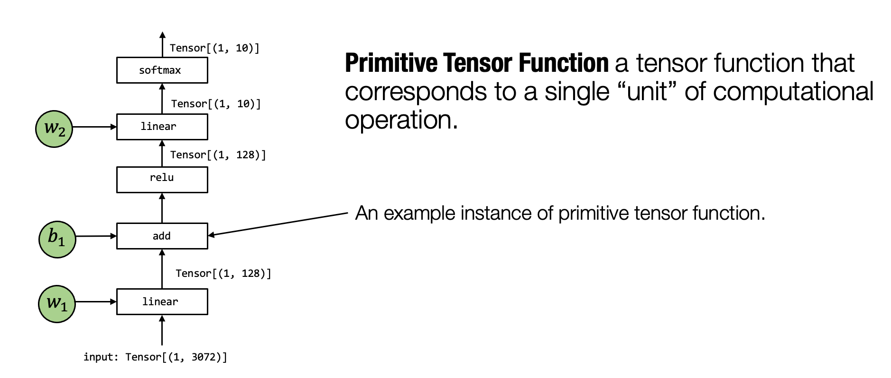
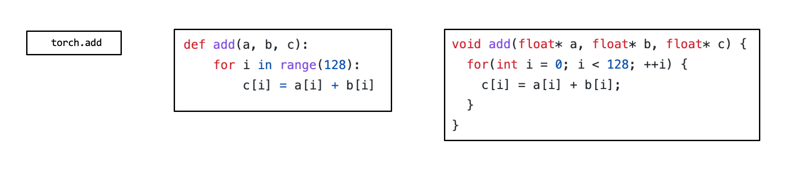
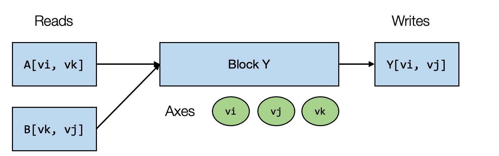

# 2.1. 元张量函数（单算子）

在上一章的概述中，我们介绍到机器学习编译的过程可以被看作张量函数之间的变换。一个典型的机器学习模型的执行包含许多步将输入张量之间转化为最终预测的计算步骤，其中的每一步都被称为元张量函数 (primitive tensor function)。



*Fig. 2.1.1* 元张量函数

在上面这张图中，张量算子 `linear`, `add`, `relu` 和 `softmax` 均为元张量函数。特别的是，许多不同的抽象能够表示（和实现）同样的元张量函数（正如下图所示）。我们可以选择调用已经预先编译的框架库（如 `torch.add` 和 `numpy.add`）并利用在 Python 中的实现。在实践中，元张量函数被例如 C 或 C++ 的低级语言所实现，并且在一些时候会包含一些汇编代码。



*Fig. 2.1.2* 同一个元张量函数的不同形式

许多机器学习框架都提供机器学习模型的编译过程，以将元张量函数变换为更加专门的、针对特定工作和部署环境的函数。


*Fig. 2.1.3* 元张量函数间的变换

上面这张图展示了一个元张量函数 `add` 的实现被变换至另一个不同实现的例子，其中在右侧的代码是一段表示可能的组合优化的伪代码：左侧代码中的循环被拆分出长度为 `4` 的单元，`f32x4.add` 对应的是一个特殊的执行向量加法计算的函数。

# 2.2. 张量程序抽象

上一节谈到了对元张量函数变换的需要。为了让我们能够更有效地变换元张量函数，我们需要一个有效的抽象来表示这些函数。

通常来说，一个典型的元张量函数实现的抽象包含了以下成分：存储数据的多维数组，驱动张量计算的循环嵌套以及计算部分本身的语句。


*Fig. 2.2.1* 元张量函数中的典型成分

我们称这类抽象为**张量程序抽象**。张量程序抽象的一个重要性质是，他们能够被一系列有效的程序变换所改变。


*Fig. 2.2.2* 一个元张量函数的序列变换

例如，我们能够通过一组变换操作（如循环拆分、并行和向量化）将上图左侧的一个初始循环程序变换为右侧的程序。

## 2.2.1. 张量程序抽象中的其它结构

重要的是，我们不能任意地对程序进行变换，比方说这可能是因为一些计算会依赖于循环之间的顺序。但幸运的是，我们所感兴趣的大多数元张量函数都具有良好的属性（例如循环迭代之间的独立性）。

张量程序可以将这些额外的信息合并为程序的一部分，以使程序变换更加便利。


*Fig. 2.2.3* 循环迭代作为张量程序的额外信息

举个例子，上面图中的程序包含额外的 `T.axis.spatial` 标注，表明 `vi` 这个特定的变量被映射到循环变量 `i`，并且所有的迭代都是独立的。这个信息对于执行这个程序而言并非必要，但会使得我们在变换这个程序时更加方便。在这个例子中，我们知道我们可以安全地并行或者重新排序所有与 `vi` 有关的循环，只要实际执行中 `vi` 的值按照从 `0` 到 `128` 的顺序变化。

# 2.3. 总结

- 元张量函数表示机器学习模型计算中的单个单元计算。
  - 一个机器学习编译过程可以有选择地转换元张量函数的实现。
- 张量程序是一个表示元张量函数的有效抽象。
  - 关键成分包括: 多维数组，循环嵌套，计算语句。
  - 程序变换可以被用于加速张量程序的执行。
  - 张量程序中额外的结构能够为程序变换提供更多的信息。

# 2.4. TensorIR: 张量程序抽象案例研究

## 2.4.1. 安装相关的包

为了本课程的目标，我们会使用 TVM （一个开源的机器学习编译框架）中一些正在持续开发的部分。我们提供了下面的命令用于为 MLC 课程安装一个包装好的版本。

```
python3 -m  pip install mlc-ai-nightly -f https://mlc.ai/wheels
```

## 2.4.2. 序言


在开始今天这一节之前，让我们回忆机器学习编译过程的关键原则。大多数的机器学习编译可以被视为张量函数之间的变换。在接下来的内容中我们主要想回答的以下几个问题：

- 什么是表示张量函数可能的抽象？
- 什么是张量函数之间可能的变换？

在这里我们将聚焦于元张量函数，部分讨论这些问题。

## 2.4.3. 学习一类张量程序抽象 – TensorIR

在之前的章节中，我们介绍过了元张量函数，讨论了张量程序抽象的总体概念。

现在我们已经准备好学习一个特定的张量程序抽象的实例：TensorIR。 TensorIR 是标准机器学习编译框架 Apache TVM 中使用的张量程序抽象。

```python
import numpy as np
import tvm
from tvm.ir.module import IRModule
from tvm.script import tir as T
```

使用张量程序抽象的主要目的是表示循环和相关的硬件加速选择，如多线程、特殊硬件指令的使用和内存访问。

为了帮助我们更好地解释，我们用下面的张量计算作为示例。

具体地，对于两个大小为 128×128 的矩阵 A 和 B，我们进行如下两步的张量计算。


上面的计算很像在我们神经网络中经常看到的典型的元张量函数：一个线性层与一个 ReLU 激活层。首先，我们使用如下 NumPy 中的数组计算实现这两个操作。

```python
dtype = "float32"
a_np = np.random.rand(128, 128).astype(dtype)
b_np = np.random.rand(128, 128).astype(dtype)
# a @ b is equivalent to np.matmul(a, b)
c_mm_relu = np.maximum(a_np @ b_np, 0)
```

在底层，NumPy 调用库（例如 OpenBLAS）和它自己在低级 C 语言中的一些实现来执行这些计算。

从张量程序抽象的角度来看，我们想彻底理解这些数组计算的**背后**的细节。具体来说，我们想问：实现相应计算的可能方式是什么？

为了说明底层细节，我们将在 NumPy API 的一个受限子集中编写示例 —— 我们称之为 **低级 NumPy**。它使用以下的约定：

- 我们将在必要时使用循环而不是数组函数来展示可能的循环计算。
- 如果可能，我们总是通过 `numpy.empty` 显式地分配数组并传递它们。

需要注意的是，这不是人们通常编写 NumPy 程序的方式。不过，它们仍然与幕后发生的事情非常相似 —— 大多数现实世界的部署解决方案都将分配与计算分开处理。特定的库使用不同形式的循环和算术计算来执行计算。当然首先它们是使用诸如 `C` 之类的低级语言实现的。

```python
def lnumpy_mm_relu(A: np.ndarray, B: np.ndarray, C: np.ndarray):
    Y = np.empty((128, 128), dtype="float32")
    for i in range(128):
        for j in range(128):
            for k in range(128):
                if k == 0:
                    Y[i, j] = 0
                Y[i, j] = Y[i, j] + A[i, k] * B[k, j]
    for i in range(128):
        for j in range(128):
            C[i, j] = max(Y[i, j], 0)
```

上面的程序是实现 `mm_relu` 操作的一种方式。该程序包含两个阶段：首先我们分配一个中间存储 Y，将矩阵乘法的结果存储在那里。然后我们在第二个 for 循环序列中计算 ReLU。你可能会注意到，这肯定不是实现 `mm_relu` 的唯一方法，当然这可能也不是你想到的第一件事。

无论如何，这确实是实现 `mm_relu` 的方式之一。我们可以通过将我们的结果与使用数组计算的原始结果进行比较来验证代码的正确性。我们将在本节的后面部分回到这里，并重新讨论其他可能的方法。

```python
c_np = np.empty((128, 128), dtype=dtype)
lnumpy_mm_relu(a_np, b_np, c_np)
np.testing.assert_allclose(c_mm_relu, c_np, rtol=1e-5)
```

上面的示例代码展示了我们如何在**幕后**实现 `mm_relu`。当然，由于 Python 解释器，代码本身会运行得很慢。尽管如此，示例 NumPy 代码包含我们将在这些计算的实际实现中使用的所有可能元素。

- 多维缓冲区（数组）。
- 在数组维度上的循环。
- 在循环下执行的计算语句。

在看过低级 NumPy 示例后，现在我们准备介绍 TensorIR。下面的代码块展示了 `mm_relu` 的 TensorIR 实现。这里的代码是用一种名为 TVMScript 的语言实现的，它是一种嵌入在 Python AST 中的特定领域方言。

```python
@tvm.script.ir_module
class MyModule:
    @T.prim_func
    def mm_relu(A: T.Buffer[(128, 128), "float32"],
                B: T.Buffer[(128, 128), "float32"],
                C: T.Buffer[(128, 128), "float32"]):
        T.func_attr({"global_symbol": "mm_relu", "tir.noalias": True})
        Y = T.alloc_buffer((128, 128), dtype="float32")
        for i, j, k in T.grid(128, 128, 128):
            with T.block("Y"):
                vi = T.axis.spatial(128, i)
                vj = T.axis.spatial(128, j)
                vk = T.axis.reduce(128, k)
                with T.init():
                    Y[vi, vj] = T.float32(0)
                Y[vi, vj] = Y[vi, vj] + A[vi, vk] * B[vk, vj]
        for i, j in T.grid(128, 128):
            with T.block("C"):
                vi = T.axis.spatial(128, i)
                vj = T.axis.spatial(128, j)
                C[vi, vj] = T.max(Y[vi, vj], T.float32(0))
```

能够同时查看 NumPy 代码和 TensorIR 代码并检查相应的元素是很有帮助的。我们将详细介绍它们。


我们首先回顾一下在 NumPy 和 TensorIR 之间具有直接对应关系的元素。接下来我们将回过来查看不属于 NumPy 程序的其他元素。

### 2.4.3.1. 函数参数与缓冲区

首先，让我们看一下函数参数。函数参数对应于 NumPy 函数上的同一组参数。

```python
# TensorIR
def mm_relu(A: T.Buffer[(128, 128), "float32"],
            B: T.Buffer[(128, 128), "float32"],
            C: T.Buffer[(128, 128), "float32"]):
    ...
# numpy
def lnumpy_mm_relu(A: np.ndarray, B: np.ndarray, C: np.ndarray):
    ...
```

这里 A、B 和 C 采用名为 `T.Buffer` 的类型，其形状参数为 `(128, 128)`，数据类型为 `float32`。这些附加信息有助于可能的机器学习编译过程以生成专门针对形状和数据类型的代码。

同样，TensorIR 在中间结果分配中也使用了缓冲区类型。

```python
# TensorIR
Y = T.alloc_buffer((128, 128), dtype="float32")
# numpy
Y = np.empty((128, 128), dtype="float32")
```

### 2.4.3.2. For 循环迭代

循环迭代也有直接对应关系。`T.grid` 是 TensorIR 中的语法糖，供我们书写多个嵌套的迭代器。

```python
# TensorIR
for i, j, k in T.grid(128, 128, 128):
# numpy
for i in range(128):
    for j in range(128):
        for k in range(128):
```

### 2.4.3.3. 计算块

主要区别之一来自计算语句。TensorIR 包含一个名为 `T.block` 的额外结构。

```python
# TensorIR
with T.block("Y"):
    vi = T.axis.spatial(128, i)
    vj = T.axis.spatial(128, j)
    vk = T.axis.reduce(128, k)
    with T.init():
        Y[vi, vj] = T.float32(0)
    Y[vi, vj] = Y[vi, vj] + A[vi, vk] * B[vk, vj]

# coressponding numpy code
vi, vj, vk = i, j, k
if vk == 0:
    Y[vi, vj] = 0
Y[vi, vj] = Y[vi, vj] + A[vi, vk] * B[vk, vj]
```

**块** 是 TensorIR 中的基本计算单位。值得注意的是，该块包含比普通 NumPy 代码更多的信息。一个块包含一组块轴（`vi、vj、vk`）和围绕它们定义的计算。

```python
vi = T.axis.spatial(128, i)
vj = T.axis.spatial(128, j)
vk = T.axis.reduce(128, k)
```

上面三行声明了关于块轴的**关键性质**，语法如下。

```python
[block_axis] = T.axis.[axis_type]([axis_range], [mapped_value])
```

这三行包含以下信息：

- 定义了 `vi`、`vj`、`vk` 应被绑定到的位置（在本例中为 `i`、`j` 和 `k`）；
- 声明了 `vi`、`vj`、`vk` 的原始范围（`T.axis.spatial(128, i)` 中的 `128`）；
- 声明了块轴的属性（`spatial`, `reduce`）。

我们一一浏览这些属性。首先，就边界关系而言，`vi = T.axis.spatial(128, i)` 有效地蕴含了 `vi = i`。`[axis_range]` 值提供了 `[block_axis]` 的预期范围。例如，`vi = T.axis.spatial(128, i)` 中的 `128` 表明 `vi` 应该在 `range(0, 128)` 中。

### 2.4.3.4. 块轴的属性

我们现在开始进一步研究块轴属性。这些轴属性标记了轴与正在执行的计算之间的关系。 下图总结了块（迭代）轴和块 `Y` 的读写关系。注意到，严格来说这个块正在对缓冲区 `Y` 进行（规约）更新，我们暂时将其标记为*写入*，因为我们不需要来自另一个块的缓冲区 `Y` 的值。



在我们的示例中，块 `Y` 通过读取来自 `A[vi, vk]` 和 `B[vk, vj]` 的值来计算结果 `Y[vi, vj]`，并对所有可能的 `vk` 执行求和。 在这个特定示例中，如果我们将 `vi`、`vj` 固定为 `(0, 1)`，并对 `vk in range(0, 128)` 执行块 `Y`，我们可以独立于其他可能的位置（具有不同 `vi`, `vj` 值的位置）有效地计算 `C[0, 1]`。

值得注意的是，对于一组固定的 `vi` 和 `vj`，计算块在 `Y` 的空间位置 (`Y[vi, vj]`) 处生成一个点值，该点值独立于 `Y` 中的其他位置（具有不同的`vi`, `vj` 值的位置）。我们可以称 `vi`、`vj` 为**空间轴**，因为它们直接对应于块写入的缓冲区空间区域的开始。 涉及归约的轴（`vk`）被命名为**归约轴**。

### 2.4.3.5. 为什么块需要额外附加的信息

一个重要的观察结果是，附加信息（块轴范围及其属性）使块轴**独立**于外部循环嵌套 `i`, `j`, `k`。

块轴信息还提供了额外的属性，帮助我们验证用于执行计算的外部循环的正确性。例如，下面的代码块会导致错误，因为循环需要一个大小为 128 的迭代器，但我们只将它绑定到一个大小为 127 的 for 循环。

```python
# wrong program due to loop and block iteration mismatch
for i in range(127):
    with T.block("C"):
        vi = T.axis.spatial(128, i)
        ^^^^^^^^^^^^^^^^^^^^^^^^^^^
        error here due to iterator size mismatch
        ...
```

这些附加信息也有助于我们进行机器学习编译分析。例如，虽然我们总是可以在空间轴上做并行化，在规约轴上进行并行化将需要特定的策略。

### 2.4.3.6. 块轴绑定的语法糖

在每个块轴直接映射到外部循环迭代器的情况下，我们可以使用 `T.axis.remap` 在一行中声明所有块轴。

```python
# SSR means the properties of each axes are "spatial", "spatial", "reduce"
vi, vj, vk = T.axis.remap("SSR", [i, j, k])
```

相当于

```python
vi = T.axis.spatial(range_of_i, i)
vj = T.axis.spatial(range_of_j, j)
vk = T.axis.reduce(range_of_k, k)
```

所以我们也可以编写如下程序。

```python
@tvm.script.ir_module
class MyModuleWithAxisRemapSugar:
    @T.prim_func
    def mm_relu(A: T.Buffer[(128, 128), "float32"],
                B: T.Buffer[(128, 128), "float32"],
                C: T.Buffer[(128, 128), "float32"]):
        T.func_attr({"global_symbol": "mm_relu", "tir.noalias": True})
        Y = T.alloc_buffer((128, 128), dtype="float32")
        for i, j, k in T.grid(128, 128, 128):
            with T.block("Y"):
                vi, vj, vk = T.axis.remap("SSR", [i, j, k])
                with T.init():
                    Y[vi, vj] = T.float32(0)
                Y[vi, vj] = Y[vi, vj] + A[vi, vk] * B[vk, vj]
        for i, j in T.grid(128, 128):
            with T.block("C"):
                vi, vj = T.axis.remap("SS", [i, j])
                C[vi, vj] = T.max(Y[vi, vj], T.float32(0))
```

### 2.4.3.7. 函数属性和装饰器

到目前为止，我们已经涵盖了 TensorIR 中的大部分元素。在这一部分中，我们将介绍 TVMScript 的其余元素。

函数属性信息包含关于函数的额外信息。

```python
T.func_attr({"global_symbol": "mm_relu", "tir.noalias": True})
```

这里的 `global_symbol` 对应函数名，`tir.noalias` 是一个属性，表示所有的缓冲存储器不重叠。你现在可以放心地跳过这些属性，因为它们不会影响对概念的整体理解。

`@tvm.script.ir_module` 和 `@T.prim_func` 这两个装饰器用于表示对应部分的类型。

`@tvm.script.ir_module` 表示 `MyModule` 是一个 IRModule。IRModule 是在机器学习编译中保存张量函数集合的容器对象。

```
type(MyModule)
```

```
tvm.ir.module.IRModule
```

```
type(MyModule["mm_relu"])
```

```
tvm.tir.function.PrimFunc
```

到目前为止，我们只看到包含单个张量函数的 IRModule。 机器学习编译过程中的一个 IRModule 可以包含多个张量函数。 以下代码块显示了具有两个函数的 IRModule 示例。

```python
@tvm.script.ir_module
class MyModuleWithTwoFunctions:
    @T.prim_func
    def mm(A: T.Buffer[(128, 128), "float32"],
           B: T.Buffer[(128, 128), "float32"],
           Y: T.Buffer[(128, 128), "float32"]):
        T.func_attr({"global_symbol": "mm", "tir.noalias": True})
        for i, j, k in T.grid(128, 128, 128):
            with T.block("Y"):
                vi, vj, vk = T.axis.remap("SSR", [i, j, k])
                with T.init():
                    Y[vi, vj] = T.float32(0)
                Y[vi, vj] = Y[vi, vj] + A[vi, vk] * B[vk, vj]

    @T.prim_func
    def relu(A: T.Buffer[(128, 128), "float32"],
             B: T.Buffer[(128, 128), "float32"]):
        T.func_attr({"global_symbol": "relu", "tir.noalias": True})
        for i, j in T.grid(128, 128):
            with T.block("B"):
                vi, vj = T.axis.remap("SS", [i, j])
                B[vi, vj] = T.max(A[vi, vj], T.float32(0))
```

### 2.4.3.8. 章节检查点

到目前为止，我们一同看过了一个 TensorIR 程序示例，并涵盖了大部分元素，包括：

- 参数和中间临时内存中的缓冲区声明；
- For 循环迭代；
- **块**和块轴属性。

在本节中，我们介绍了一个 TensorIR 示例，它涵盖了机器学习编译中最常见的元素。

TensorIR 包含的元素比我们在本节中介绍的更多，但本节涵盖了可以让我们开始机器学习编译之旅的大部分关键部分。我们将在后面的章节中介绍遇到的新元素。

## 2.4.4. 变换

在上一节中，我们了解了 TensorIR 及其关键元素。 现在，让我们了解所有机器学习编译工作流的主要成分——元张量函数的变换。

在上一节中，我们给出了如何使用低级 NumPy 编写 `mm_relu` 的示例。 在实践中，可以有多种方法来实现相同的功能，并且每种实现都可能导致不同的性能。

我们将讨论性能背后的原因以及如何在以后的内容中利用这些变体。 在本节中，让我们关注使用变换获得不同实现变体的能力。

```python
def lnumpy_mm_relu_v2(A: np.ndarray, B: np.ndarray, C: np.ndarray):
    Y = np.empty((128, 128), dtype="float32")
    for i in range(128):
        for j0 in range(32):
            for k in range(128):
                for j1 in range(4):
                    j = j0 * 4 + j1
                    if k == 0:
                        Y[i, j] = 0
                    Y[i, j] = Y[i, j] + A[i, k] * B[k, j]
    for i in range(128):
        for j in range(128):
            C[i, j] = max(Y[i, j], 0)

c_np = np.empty((128, 128), dtype=dtype)
lnumpy_mm_relu_v2(a_np, b_np, c_np)
np.testing.assert_allclose(c_mm_relu, c_np, rtol=1e-5)
```

上面的代码块显示了 `mm_relu` 的一个稍微不同的变体。它与原始程序的不同是

- 我们用两个循环 `j0` 和 `j1` 替换了 `j` 循环；
- 迭代顺序略有变化。

为了获得 `lnumpy_mm_relu_v2`，我们必须重写一个新函数（或手动复制粘贴和编辑）。TensorIR 引入了一个名为 Schedule 的辅助结构，它允许我们务实地做到这一点。

为了提醒我们自己，让我们再看看当前的 `MyModule` 内容。

```python
import IPython

IPython.display.Code(MyModule.script(), language="python")
```

```python
@tvm.script.ir_module
class Module:
    @T.prim_func
    def mm_relu(A: T.Buffer[(128, 128), "float32"], B: T.Buffer[(128, 128), "float32"], C: T.Buffer[(128, 128), "float32"]) -> None:
        # function attr dict
        T.func_attr({"global_symbol": "mm_relu", "tir.noalias": True})
        # body
        # with T.block("root")
        Y = T.alloc_buffer([128, 128], dtype="float32")
        for i, j, k in T.grid(128, 128, 128):
            with T.block("Y"):
                vi, vj, vk = T.axis.remap("SSR", [i, j, k])
                T.reads(A[vi, vk], B[vk, vj])
                T.writes(Y[vi, vj])
                with T.init():
                    Y[vi, vj] = T.float32(0)
                Y[vi, vj] = Y[vi, vj] + A[vi, vk] * B[vk, vj]
        for i, j in T.grid(128, 128):
            with T.block("C"):
                vi, vj = T.axis.remap("SS", [i, j])
                T.reads(Y[vi, vj])
                T.writes(C[vi, vj])
                C[vi, vj] = T.max(Y[vi, vj], T.float32(0))
```

现在我们准备好尝试代码变换。我们首先创建一个以给定的 `MyModule` 作为输入的 Schedule 辅助类。

```python
sch = tvm.tir.Schedule(MyModule)
```

然后我们执行以下操作以获得对块 `Y` 和相应循环的引用。

```python
block_Y = sch.get_block("Y", func_name="mm_relu")
i, j, k = sch.get_loops(block_Y)
```

现在我们准备好进行变换了。我们将执行的第一个变换是将循环 `j` 分成两个循环，其中内部循环的长度为 4。请注意，变换是程序性的，因此如果你不小心执行了两次该代码块，我们将得到“变量 `j` 不再存在”的错误。如果发生这种情况，你可以从头（创建 `sch` 的位置）开始再次运行。

```python
j0, j1 = sch.split(j, factors=[None, 4])
```

我们可以查看存储在 `sch.mod` 中的变换结果。

```python
IPython.display.Code(sch.mod.script(), language="python")
```

```python
@tvm.script.ir_module
class Module:
    @T.prim_func
    def mm_relu(A: T.Buffer[(128, 128), "float32"], B: T.Buffer[(128, 128), "float32"], C: T.Buffer[(128, 128), "float32"]) -> None:
        # function attr dict
        T.func_attr({"global_symbol": "mm_relu", "tir.noalias": True})
        # body
        # with T.block("root")
        Y = T.alloc_buffer([128, 128], dtype="float32")
        for i, j_0, j_1, k in T.grid(128, 32, 4, 128):
            with T.block("Y"):
                vi = T.axis.spatial(128, i)
                vj = T.axis.spatial(128, j_0 * 4 + j_1)
                vk = T.axis.reduce(128, k)
                T.reads(A[vi, vk], B[vk, vj])
                T.writes(Y[vi, vj])
                with T.init():
                    Y[vi, vj] = T.float32(0)
                Y[vi, vj] = Y[vi, vj] + A[vi, vk] * B[vk, vj]
        for i, j in T.grid(128, 128):
            with T.block("C"):
                vi, vj = T.axis.remap("SS", [i, j])
                T.reads(Y[vi, vj])
                T.writes(C[vi, vj])
                C[vi, vj] = T.max(Y[vi, vj], T.float32(0))
```

在变换的第一步之后，我们创建了两个新的循环，`j_0` 和 `j_1`，分别对应范围 32 和 4。下一步是重新排序这两个循环。

```python
sch.reorder(j0, k, j1)
IPython.display.Code(sch.mod.script(), language="python")
```

```python
@tvm.script.ir_module
class Module:
    @T.prim_func
    def mm_relu(A: T.Buffer[(128, 128), "float32"], B: T.Buffer[(128, 128), "float32"], C: T.Buffer[(128, 128), "float32"]) -> None:
        # function attr dict
        T.func_attr({"global_symbol": "mm_relu", "tir.noalias": True})
        # body
        # with T.block("root")
        Y = T.alloc_buffer([128, 128], dtype="float32")
        for i, j_0, k, j_1 in T.grid(128, 32, 128, 4):
            with T.block("Y"):
                vi = T.axis.spatial(128, i)
                vj = T.axis.spatial(128, j_0 * 4 + j_1)
                vk = T.axis.reduce(128, k)
                T.reads(A[vi, vk], B[vk, vj])
                T.writes(Y[vi, vj])
                with T.init():
                    Y[vi, vj] = T.float32(0)
                Y[vi, vj] = Y[vi, vj] + A[vi, vk] * B[vk, vj]
        for i, j in T.grid(128, 128):
            with T.block("C"):
                vi, vj = T.axis.remap("SS", [i, j])
                T.reads(Y[vi, vj])
                T.writes(C[vi, vj])
                C[vi, vj] = T.max(Y[vi, vj], T.float32(0))
```

现在重新排序后的代码非常类似于 `lnumpy_mm_relu_v2`。

### 2.4.4.1. 获得另一个变体

在本节中，我们将继续进行另外两步变换以得到另一个变体。首先，我们使用名为 `reverse_compute_at` 的原语将块 `C` 移动到 `Y` 的内循环里。

```python
block_C = sch.get_block("C", "mm_relu")
sch.reverse_compute_at(block_C, j0)
IPython.display.Code(sch.mod.script(), language="python")
```

```python
@tvm.script.ir_module
class Module:
    @T.prim_func
    def mm_relu(A: T.Buffer[(128, 128), "float32"], B: T.Buffer[(128, 128), "float32"], C: T.Buffer[(128, 128), "float32"]) -> None:
        # function attr dict
        T.func_attr({"global_symbol": "mm_relu", "tir.noalias": True})
        # body
        # with T.block("root")
        Y = T.alloc_buffer([128, 128], dtype="float32")
        for i, j_0 in T.grid(128, 32):
            for k, j_1 in T.grid(128, 4):
                with T.block("Y"):
                    vi = T.axis.spatial(128, i)
                    vj = T.axis.spatial(128, j_0 * 4 + j_1)
                    vk = T.axis.reduce(128, k)
                    T.reads(A[vi, vk], B[vk, vj])
                    T.writes(Y[vi, vj])
                    with T.init():
                        Y[vi, vj] = T.float32(0)
                    Y[vi, vj] = Y[vi, vj] + A[vi, vk] * B[vk, vj]
            for ax0 in T.serial(4):
                with T.block("C"):
                    vi = T.axis.spatial(128, i)
                    vj = T.axis.spatial(128, j_0 * 4 + ax0)
                    T.reads(Y[vi, vj])
                    T.writes(C[vi, vj])
                    C[vi, vj] = T.max(Y[vi, vj], T.float32(0))
```

到目前为止，我们将归约初始化和更新放在一个块体中。这种组合形式为循环变换带来了便利（因为初始化和更新的外循环 `i`、`j` 通常需要彼此保持同步）。

在循环变换之后，我们可以将 `Y` 元素的初始化与归约更新分开。我们可以通过 `decompose_reduction` 原语来做到这一点。（注意：这也是 TVM 在以后编译的时候隐式做的，所以这一步的主要目的是让它显式，看看最终效果）。

```python
sch.decompose_reduction(block_Y, k)
IPython.display.Code(sch.mod.script(), language="python")
```

最终变换后的代码类似于以下低级 NumPy 代码。

```python
def lnumpy_mm_relu_v3(A: np.ndarray, B: np.ndarray, C: np.ndarray):
    Y = np.empty((128, 128), dtype="float32")
    for i in range(128):
        for j0 in range(32):
            # Y_init
            for j1 in range(4):
                j = j0 * 4 + j1
                Y[i, j] = 0
            # Y_update
            for k in range(128):
                for j1 in range(4):
                    j = j0 * 4 + j1
                    Y[i, j] = Y[i, j] + A[i, k] * B[k, j]
            # C
            for j1 in range(4):
                j = j0 * 4 + j1
                C[i, j] = max(Y[i, j], 0)

c_np = np.empty((128, 128), dtype=dtype)
lnumpy_mm_relu_v3(a_np, b_np, c_np)
np.testing.assert_allclose(c_mm_relu, c_np, rtol=1e-5)
```

### 2.4.4.2. 章节总结与讨论

本节的主要内容是习惯增量代码变换的范例。在我们的特定示例中，我们使用 `tir.Schedule` 作为辅助工具。

重要的是，我们避免了重新创建同一程序的不同变体（`lnumpy_mm_relu`、`lnumpy_mm_relu_v2` 和 `lnumpy_mm_relu_v3`）的需要。 块中的附加信息（轴信息）是我们可以在后台进行此类变换的原因。

## 2.4.5. 构建与运行

到目前为止，我们只查看了变换结果的 TVMScript 输出。我们也可以运行 IRModule 中得到的程序。

首先，我们调用构建函数将 IRModule 变换为 `runtime.Module`，它表示可运行函数的集合。 这里 `target` 指定了部署环境的详细信息。对于现在这种特殊情况，我们将使用 `llvm`，它可以帮助我们编译到本机 CPU 平台。

当我们针对不同的平台（例如 Android 手机）或具有特殊说明的平台（Intel Skylake）时，我们需要相应地调整 `target`。当我们开始部署到这些环境时，我们将讨论不同的目标选择。

```python
rt_lib = tvm.build(MyModule, target="llvm")
```

然后，我们将创建三个用于保存输入和输出的 TVM NDArray。

```python
a_nd = tvm.nd.array(a_np)
b_nd = tvm.nd.array(b_np)
c_nd = tvm.nd.empty((128, 128), dtype="float32")
type(c_nd)
```

```python
tvm.runtime.ndarray.NDArray
```

最后，我们可以从 `rt_lib` 中获取可运行函数，并通过传递三个数组参数来执行它。我们可以进一步运行验证来检查代码差异。

```python
func_mm_relu = rt_lib["mm_relu"]
func_mm_relu(a_nd, b_nd, c_nd)

np.testing.assert_allclose(c_mm_relu, c_nd.numpy(), rtol=1e-5)
```

我们已经构建并运行了原始的 `MyModule`。 我们还可以构建变换后的程序。

```python
rt_lib_after = tvm.build(sch.mod, target="llvm")
rt_lib_after["mm_relu"](a_nd, b_nd, c_nd)
np.testing.assert_allclose(c_mm_relu, c_nd.numpy(), rtol=1e-5)
```

最后，我们可以比较一下两者的时间差。 `time_evaluator` 是一个辅助的测试函数，可用于比较不同生成函数的运行性能。

```python
f_timer_before = rt_lib.time_evaluator("mm_relu", tvm.cpu())
print("Time cost of MyModule %g sec" % f_timer_before(a_nd, b_nd, c_nd).mean)
f_timer_after = rt_lib_after.time_evaluator("mm_relu", tvm.cpu())
print("Time cost of transformed sch.mod %g sec" % f_timer_after(a_nd, b_nd, c_nd).mean)
```

```
Time cost of MyModule 0.00397021 sec
Time cost of transformed sch.mod 0.00134683 sec
```

两个代码之间的运行时间差异很有意思。让我们快速分析一下影响性能的可能因素。 首先，让我们回忆原始代码的两种变体。

```python
import IPython

IPython.display.Code(MyModule.script(), language="python")
```

```python
@tvm.script.ir_module
class Module:
    @T.prim_func
    def mm_relu(A: T.Buffer[(128, 128), "float32"], B: T.Buffer[(128, 128), "float32"], C: T.Buffer[(128, 128), "float32"]) -> None:
        # function attr dict
        T.func_attr({"global_symbol": "mm_relu", "tir.noalias": True})
        # body
        # with T.block("root")
        Y = T.alloc_buffer([128, 128], dtype="float32")
        for i, j, k in T.grid(128, 128, 128):
            with T.block("Y"):
                vi, vj, vk = T.axis.remap("SSR", [i, j, k])
                T.reads(A[vi, vk], B[vk, vj])
                T.writes(Y[vi, vj])
                with T.init():
                    Y[vi, vj] = T.float32(0)
                Y[vi, vj] = Y[vi, vj] + A[vi, vk] * B[vk, vj]
        for i, j in T.grid(128, 128):
            with T.block("C"):
                vi, vj = T.axis.remap("SS", [i, j])
                T.reads(Y[vi, vj])
                T.writes(C[vi, vj])
                C[vi, vj] = T.max(Y[vi, vj], T.float32(0))
```

```python
IPython.display.Code(sch.mod.script(), language="python")
```

```python
@tvm.script.ir_module
class Module:
    @T.prim_func
    def mm_relu(A: T.Buffer[(128, 128), "float32"], B: T.Buffer[(128, 128), "float32"], C: T.Buffer[(128, 128), "float32"]) -> None:
        # function attr dict
        T.func_attr({"global_symbol": "mm_relu", "tir.noalias": True})
        # body
        # with T.block("root")
        Y = T.alloc_buffer([128, 128], dtype="float32")
        for i, j_0 in T.grid(128, 32):
            for k, j_1 in T.grid(128, 4):
                with T.block("Y"):
                    vi = T.axis.spatial(128, i)
                    vj = T.axis.spatial(128, j_0 * 4 + j_1)
                    vk = T.axis.reduce(128, k)
                    T.reads(A[vi, vk], B[vk, vj])
                    T.writes(Y[vi, vj])
                    with T.init():
                        Y[vi, vj] = T.float32(0)
                    Y[vi, vj] = Y[vi, vj] + A[vi, vk] * B[vk, vj]
            for ax0 in T.serial(4):
                with T.block("C"):
                    vi = T.axis.spatial(128, i)
                    vj = T.axis.spatial(128, j_0 * 4 + ax0)
                    T.reads(Y[vi, vj])
                    T.writes(C[vi, vj])
                    C[vi, vj] = T.max(Y[vi, vj], T.float32(0))
```


要了解为什么不同的循环变体会导致不同的性能，我们需要回顾一个事实，即访问 `A` 和 `B` 中的任何内存块的速度并不一致。现代 CPU 带有多级缓存，需要先将数据提取到缓存中，然后 CPU 才能访问它。

重要的是，访问已经在缓存中的数据要快得多。CPU 采用的一种策略是获取彼此更接近的数据。 当我们读取内存中的一个元素时，它会尝试将附近的元素（更正式的名称为“缓存行”）获取到缓存中。 因此，当你读取下一个元素时，它已经在缓存中。 因此，具有连续内存访问的代码通常比随机访问内存不同部分的代码更快。


现在让我们看看上面的迭代可视化，分析一下是怎么回事。 在这个分析中，让我们关注最里面的两个循环：`k` 和 `j1`。高亮的地方显示了当我们针对 `k` 的一个特定实例迭代 `j1` 时迭代触及的 `Y`、`A` 和 `B` 中的相应区域。

我们可以发现，`j1` 这一迭代产生了对 `B` 元素的**连续访问**。具体来说，它意味着在 `j1=0` 和 `j1=1` 时我们读取的值彼此相邻。这可以让我们拥有更好的缓存访问行为。此外，我们使 `C` 的计算更接近 `Y`，从而实现更好的缓存行为。

我们当前的示例主要是为了证明不同的代码变体可以导致不同的性能。更多的变换步骤可以帮助我们获得更好的性能，我们将在以后的章节中介绍。本练习的主要目标是首先让我们获得程序变换工具，并首先体验通过变换可能实现的功能。

### 2.4.5.1. 练习

作为练习，尝试不同的 `j_factor` 选择，看看它们如何影响代码的性能。

```python
def transform(mod, jfactor):
    sch = tvm.tir.Schedule(mod)
    block_Y = sch.get_block("Y", func_name="mm_relu")
    i, j, k = sch.get_loops(block_Y)
    j0, j1 = sch.split(j, factors=[None, jfactor])
    sch.reorder(j0, k, j1)
    block_C = sch.get_block("C", "mm_relu")
    sch.reverse_compute_at(block_C, j0)
    return sch.mod

mod_transformed = transform(MyModule, jfactor=8)

rt_lib_transformed = tvm.build(mod_transformed, "llvm")
f_timer_transformed = rt_lib_transformed.time_evaluator("mm_relu", tvm.cpu())
print("Time cost of transformed mod_transformed %g sec" % f_timer_transformed(a_nd, b_nd, c_nd).mean)
# display the code below
IPython.display.Code(mod_transformed.script(), language="python")
```

```
Time cost of transformed mod_transformed 0.000686584 sec
```


```python
@tvm.script.ir_module
class Module:
    @T.prim_func
    def mm_relu(A: T.Buffer[(128, 128), "float32"], B: T.Buffer[(128, 128), "float32"], C: T.Buffer[(128, 128), "float32"]) -> None:
        # function attr dict
        T.func_attr({"global_symbol": "mm_relu", "tir.noalias": True})
        # body
        # with T.block("root")
        Y = T.alloc_buffer([128, 128], dtype="float32")
        for i, j_0 in T.grid(128, 16):
            for k, j_1 in T.grid(128, 8):
                with T.block("Y"):
                    vi = T.axis.spatial(128, i)
                    vj = T.axis.spatial(128, j_0 * 8 + j_1)
                    vk = T.axis.reduce(128, k)
                    T.reads(A[vi, vk], B[vk, vj])
                    T.writes(Y[vi, vj])
                    with T.init():
                        Y[vi, vj] = T.float32(0)
                    Y[vi, vj] = Y[vi, vj] + A[vi, vk] * B[vk, vj]
            for ax0 in T.serial(8):
                with T.block("C"):
                    vi = T.axis.spatial(128, i)
                    vj = T.axis.spatial(128, j_0 * 8 + ax0)
                    T.reads(Y[vi, vj])
                    T.writes(C[vi, vj])
                    C[vi, vj] = T.max(Y[vi, vj], T.float32(0))
```

## 2.4.6. 创建 TensorIR 并与之交互的方法

在上面几节中，我们了解了 TensorIR 抽象和程序变换的方法。TensorIR 具有一个名为“块”的附加结构，可以帮助我们分析和执行代码变换。自然而然我们可能会问一个问题：创建 TensorIR 函数并与之交互的常用方法有什么？

### 2.4.6.1. 通过 TVMScript 创建 TensorIR

获取 TensorIR 函数的第一种方法是直接在 TVMScript 中编写函数，这也是我们在上一节中使用的方法。 TVMScript 还允许我们在必要时跳过某些信息部分。 例如，`T.axis.remap` 使我们能够缩短迭代器大小注释。

TVMScript 也是一种在变换过程中检查张量函数的有用方法。在某些情况下，一种很有帮助的做法是打印出 TVMScript，进行一些手动编辑，然后将其反馈给机器学习编译流程以调试和尝试可能的（手动）变换，然后将变换后的程序重新应用到 MLC 流程中。

### 2.4.6.2. 使用张量表达式生成 TensorIR 代码

在许多情况下，我们的开发形式是不在循环级别的更高级别的抽象。 所以另一种常见的获取 TensorIR 的方式是务实地生成相关代码。

张量表达式 (TE) 是一种特定领域的语言，它通过 API 之类的表达式描述一系列计算。

```python
from tvm import te

A = te.placeholder((128, 128), "float32", name="A")
B = te.placeholder((128, 128), "float32", name="B")
k = te.reduce_axis((0, 128), "k")
Y = te.compute((128, 128), lambda i, j: te.sum(A[i, k] * B[k, j], axis=k), name="Y")
C = te.compute((128, 128), lambda i, j: te.max(Y[i, j], 0), name="C")
```

这里 `te.compute` 采用签名 `te.compute(output_shape, fcompute)`。 `fcompute` 函数描述了对于给定的索引 `(i, j)` 我们要如何计算元素 `Y[i, j]` 的值。

```python
lambda i, j: te.sum(A[i, k] * B[k, j], axis=k)
```

上面的 lambda 表达式描述了计算 Yij=∑kAikBkj。在描述计算之后，我们可以通过传递我们感兴趣的相关参数来创建一个 TensorIR 函数。在这种特殊情况下，我们想要创建一个具有两个输入参数（`A`，`B`）和一个输出参数（`C`）的函数。

```python
te_func = te.create_prim_func([A, B, C]).with_attr({"global_symbol": "mm_relu"})
MyModuleFromTE = tvm.IRModule({"mm_relu": te_func})
IPython.display.Code(MyModuleFromTE.script(), language="python")
```

```python
@tvm.script.ir_module
class Module:
    @T.prim_func
    def mm_relu(A: T.Buffer[(128, 128), "float32"], B: T.Buffer[(128, 128), "float32"], C: T.Buffer[(128, 128), "float32"]) -> None:
        # function attr dict
        T.func_attr({"global_symbol": "mm_relu", "tir.noalias": True})
        # body
        # with T.block("root")
        Y = T.alloc_buffer([128, 128], dtype="float32")
        for i0, i1, i2 in T.grid(128, 128, 128):
            with T.block("Y"):
                i, j, k = T.axis.remap("SSR", [i0, i1, i2])
                T.reads(A[i, k], B[k, j])
                T.writes(Y[i, j])
                with T.init():
                    Y[i, j] = T.float32(0)
                Y[i, j] = Y[i, j] + A[i, k] * B[k, j]
        for i0, i1 in T.grid(128, 128):
            with T.block("C"):
                i, j = T.axis.remap("SS", [i0, i1])
                T.reads(Y[i, j])
                T.writes(C[i, j])
                C[i, j] = T.max(Y[i, j], T.float32(0))
```

张量表达式 API 作为一个有用的工具，帮助为给定的更高级别的输入生成 TensorIR 函数。

## 2.4.7. 作为变换结果的 TensorIR 函数

在实践中，我们还将 TensorIR 函数作为变换的结果。 当我们从两个元张量函数（`mm` 和 `relu`）开始，然后应用变换将它们“融合”成单个原始张量函数 `mm_relu` 时，就会发生这种情况。我们将在以后的章节中介绍详细信息。

## 2.4.8. 讨论

在本节中，让我们回顾一下到目前为止我们学到了什么。我们了解到，一个常见的机器学习编译过程遵循一系列程序变换。将 TensorIR 变换过程与低级 NumPy 参考开发过程进行比较是很有趣的。


上图显示了标准的开发过程。我们需要重复开发不同程序变体的过程，然后（如果它是编译语言，则构建）在感兴趣的平台上运行它们。

机器学习编译流程（如下图所示）的主要区别在于 IRModule（程序）之间的程序变换。所以我们不仅可以通过开发（通过手动编写代码或生成代码）提出程序变体，还可以通过变换张量程序来获得变体。

变换是一个非常强大的工具，可以帮助我们简化开发成本并为流程引入更多自动化。本节介绍了通过 TensorIR 对元张量函数的特定视角，我们将在未来涵盖更多视角。


值得注意的是，直接代码开发和变换在实践中同样重要：我们仍然可以利用大量领域专业知识来开发和优化部分程序，然后将其与基于变换的方法相结合。我们将在以后的章节中讨论如何将这两种实践结合起来。

## 2.4.9. 总结

- TensorIR 抽象
  - 包含循环、多维缓冲区等常用元素
  - 引入了一个封装循环计算要求的新结构**块**。
  - 可以在 Python AST 中构建（通过 TVMScript）
- 我们可以使用变换来创建不同的 TensorIR 变体。
- 通用 MLC 流程：开发、变换、构建。

# 2.5. TensorIR 练习

```python
import IPython
import numpy as np
import tvm
from tvm.ir.module import IRModule
from tvm.script import tir as T
```

## 2.5.1. 第一节：如何编写 TensorIR

在本节中，让我们尝试根据高级指令（例如 Numpy 或 Torch）手动编写 TensorIR。首先，我们给出一个逐位相加函数的例子，来展示我们应该如何编写一个 TensorIR 函数。

### 2.5.1.1. 示例：逐位相加

首先，让我们尝试使用 Numpy 编写一个逐位相加函数。

```python
# init data
a = np.arange(16).reshape(4, 4)
b = np.arange(16, 0, -1).reshape(4, 4)
```

```python
# numpy version
c_np = a + b
c_np
```

```
array([[16, 16, 16, 16],
       [16, 16, 16, 16],
       [16, 16, 16, 16],
       [16, 16, 16, 16]])
```

在我们直接编写 TensorIR 之前，我们应该首先将高级计算抽象（例如，`ndarray + ndarray`）转换为低级 Python 实现（具有元素访问和操作的循环的标准）。

值得注意的是，输出数组（或缓冲区）的初始值并不总是 0。我们需要在我们的实现中编写或初始化它，这对于归约运算符（例如 `matmul` 和 `conv`）很重要。

```python
# low-level numpy version
def lnumpy_add(a: np.ndarray, b: np.ndarray, c: np.ndarray):
  for i in range(4):
    for j in range(4):
      c[i, j] = a[i, j] + b[i, j]
c_lnumpy = np.empty((4, 4), dtype=np.int64)
lnumpy_add(a, b, c_lnumpy)
c_lnumpy
```

```
array([[16, 16, 16, 16],
       [16, 16, 16, 16],
       [16, 16, 16, 16],
       [16, 16, 16, 16]])
```

现在，让我们更进一步：将低级 NumPy 实现转换为 TensorIR，并将结果与来自 NumPy 的结果进行比较。

```python
# TensorIR version
@tvm.script.ir_module
class MyAdd:
  @T.prim_func
  def add(A: T.Buffer[(4, 4), "int64"],
          B: T.Buffer[(4, 4), "int64"],
          C: T.Buffer[(4, 4), "int64"]):
    T.func_attr({"global_symbol": "add"})
    for i, j in T.grid(4, 4):
      with T.block("C"):
        vi = T.axis.spatial(4, i)
        vj = T.axis.spatial(4, j)
        C[vi, vj] = A[vi, vj] + B[vi, vj]

rt_lib = tvm.build(MyAdd, target="llvm")
a_tvm = tvm.nd.array(a)
b_tvm = tvm.nd.array(b)
c_tvm = tvm.nd.array(np.empty((4, 4), dtype=np.int64))
rt_lib["add"](a_tvm, b_tvm, c_tvm)
np.testing.assert_allclose(c_tvm.numpy(), c_np, rtol=1e-5)
```

到这里，我们就完成了 TensorIR 函数。请花点时间完成以下练习。

### 2.5.1.2. 练习 1：广播加法

请编写一个 TensorIR 函数，将两个数组以广播的方式相加。

```python
# init data
a = np.arange(16).reshape(4, 4)
b = np.arange(4, 0, -1).reshape(4)
```

```python
# numpy version
c_np = a + b
c_np
```

```
array([[ 4,  4,  4,  4],
       [ 8,  8,  8,  8],
       [12, 12, 12, 12],
       [16, 16, 16, 16]])
```

请完成以下 IRModule `MyAdd` 并运行代码以检查你的实现。

```python
@tvm.script.ir_module
class MyAdd:
  @T.prim_func
  def add():
    T.func_attr({"global_symbol": "add", "tir.noalias": True})
    # TODO
    ...

rt_lib = tvm.build(MyAdd, target="llvm")
a_tvm = tvm.nd.array(a)
b_tvm = tvm.nd.array(b)
c_tvm = tvm.nd.array(np.empty((4, 4), dtype=np.int64))
rt_lib["add"](a_tvm, b_tvm, c_tvm)
np.testing.assert_allclose(c_tvm.numpy(), c_np, rtol=1e-5)
```

### 2.5.1.3. 练习 2：二维卷积

然后，让我们尝试做一些具有挑战性的事情：二维卷积。这是图像处理中的常见操作。

这是使用 NCHW 布局的卷积的数学定义：


其中，`A` 是输入张量，`W` 是权重张量，`b` 是批次索引，`k` 是输出通道，`i` 和 `j` 是图像高度和宽度的索引，`di` 和 `dj` 是权重的索引，`q` 是输入通道，`strides` 是过滤器窗口的步幅。

在练习中，我们选择了一个小而简单的情况，即 `stride=1, padding=0`。

```python
N, CI, H, W, CO, K = 1, 1, 8, 8, 2, 3
OUT_H, OUT_W = H - K + 1, W - K + 1
data = np.arange(N*CI*H*W).reshape(N, CI, H, W)
weight = np.arange(CO*CI*K*K).reshape(CO, CI, K, K)
```

```python
# torch version
import torch

data_torch = torch.Tensor(data)
weight_torch = torch.Tensor(weight)
conv_torch = torch.nn.functional.conv2d(data_torch, weight_torch)
conv_torch = conv_torch.numpy().astype(np.int64)
conv_torch
```

```
array([[[[ 474,  510,  546,  582,  618,  654],
         [ 762,  798,  834,  870,  906,  942],
         [1050, 1086, 1122, 1158, 1194, 1230],
         [1338, 1374, 1410, 1446, 1482, 1518],
         [1626, 1662, 1698, 1734, 1770, 1806],
         [1914, 1950, 1986, 2022, 2058, 2094]],

        [[1203, 1320, 1437, 1554, 1671, 1788],
         [2139, 2256, 2373, 2490, 2607, 2724],
         [3075, 3192, 3309, 3426, 3543, 3660],
         [4011, 4128, 4245, 4362, 4479, 4596],
         [4947, 5064, 5181, 5298, 5415, 5532],
         [5883, 6000, 6117, 6234, 6351, 6468]]]])
```

请完成以下 IRModule `MyConv` 并运行代码以检查您的实现。

```python
@tvm.script.ir_module
class MyConv:
  @T.prim_func
  def conv():
    T.func_attr({"global_symbol": "conv", "tir.noalias": True})
    # TODO
    ...

rt_lib = tvm.build(MyConv, target="llvm")
data_tvm = tvm.nd.array(data)
weight_tvm = tvm.nd.array(weight)
conv_tvm = tvm.nd.array(np.empty((N, CO, OUT_H, OUT_W), dtype=np.int64))
rt_lib["conv"](data_tvm, weight_tvm, conv_tvm)
np.testing.assert_allclose(conv_tvm.numpy(), conv_torch, rtol=1e-5)
```

## 2.5.2. 第二节：如何变换 TensorIR

在讲座中，我们了解到 TensorIR 不仅是一种编程语言，而且还是一种程序变换的抽象。在本节中，让我们尝试变换程序。我们在采用了 `bmm_relu` (`batched_matmul_relu`)，这是一种常见于 Transformer 等模型中的操作变体。

### 2.5.2.1. 并行化、向量化与循环展开

首先，我们介绍一些新的原语：`parallel`、`vectorize` 和 `unroll`。这三个原语被应用于循环上，指示循环应当如何执行。这是示例：

```python
@tvm.script.ir_module
class MyAdd:
  @T.prim_func
  def add(A: T.Buffer[(4, 4), "int64"],
          B: T.Buffer[(4, 4), "int64"],
          C: T.Buffer[(4, 4), "int64"]):
    T.func_attr({"global_symbol": "add"})
    for i, j in T.grid(4, 4):
      with T.block("C"):
        vi = T.axis.spatial(4, i)
        vj = T.axis.spatial(4, j)
        C[vi, vj] = A[vi, vj] + B[vi, vj]

sch = tvm.tir.Schedule(MyAdd)
block = sch.get_block("C", func_name="add")
i, j = sch.get_loops(block)
i0, i1 = sch.split(i, factors=[2, 2])
sch.parallel(i0)
sch.unroll(i1)
sch.vectorize(j)
IPython.display.Code(sch.mod.script(), language="python")
```

```python
@tvm.script.ir_module
class Module:
    @T.prim_func
    def add(A: T.Buffer[(4, 4), "int64"], B: T.Buffer[(4, 4), "int64"], C: T.Buffer[(4, 4), "int64"]) -> None:
        # function attr dict
        T.func_attr({"global_symbol": "add"})
        # body
        # with T.block("root")
        for i_0 in T.parallel(2):
            for i_1 in T.unroll(2):
                for j in T.vectorized(4):
                    with T.block("C"):
                        vi = T.axis.spatial(4, i_0 * 2 + i_1)
                        vj = T.axis.spatial(4, j)
                        T.reads(A[vi, vj], B[vi, vj])
                        T.writes(C[vi, vj])
                        C[vi, vj] = A[vi, vj] + B[vi, vj]
```

### 2.5.2.2. 练习 3：变换批量矩阵乘法程序

现在，让我们回到 `bmm_relu` 练习。首先，让我们看看 `bmm` 的定义：


现在是你为 `bmm_relu` 编写 TensorIR 的时候了。我们提供 lnumpy 函数作为提示：

```python
def lnumpy_mm_relu_v2(A: np.ndarray, B: np.ndarray, C: np.ndarray):
    Y = np.empty((16, 128, 128), dtype="float32")
    for n in range(16):
        for i in range(128):
            for j in range(128):
                for k in range(128):
                    if k == 0:
                        Y[n, i, j] = 0
                    Y[n, i, j] = Y[n, i, j] + A[n, i, k] * B[n, k, j]
    for n in range(16):
        for i in range(128):
            for j in range(128):
                C[n, i, j] = max(Y[n, i, j], 0)
```

```python
@tvm.script.ir_module
class MyBmmRelu:
  @T.prim_func
  def bmm_relu():
    T.func_attr({"global_symbol": "bmm_relu", "tir.noalias": True})
    # TODO
    ...

sch = tvm.tir.Schedule(MyBmmRelu)
IPython.display.Code(sch.mod.script(), language="python")
# Also please validate your result
```

在本练习中，让我们专注于将原始程序变换为特定目标。请注意，由于硬件不同，目标程序可能不是最好的程序。但是这个练习旨在让你了解如何将程序变换为想要的程序。 这是目标程序：

```python
@tvm.script.ir_module
class TargetModule:
    @T.prim_func
    def bmm_relu(A: T.Buffer[(16, 128, 128), "float32"], B: T.Buffer[(16, 128, 128), "float32"], C: T.Buffer[(16, 128, 128), "float32"]) -> None:
        T.func_attr({"global_symbol": "bmm_relu", "tir.noalias": True})
        Y = T.alloc_buffer([16, 128, 128], dtype="float32")
        for i0 in T.parallel(16):
            for i1, i2_0 in T.grid(128, 16):
                for ax0_init in T.vectorized(8):
                    with T.block("Y_init"):
                        n, i = T.axis.remap("SS", [i0, i1])
                        j = T.axis.spatial(128, i2_0 * 8 + ax0_init)
                        Y[n, i, j] = T.float32(0)
                for ax1_0 in T.serial(32):
                    for ax1_1 in T.unroll(4):
                        for ax0 in T.serial(8):
                            with T.block("Y_update"):
                                n, i = T.axis.remap("SS", [i0, i1])
                                j = T.axis.spatial(128, i2_0 * 8 + ax0)
                                k = T.axis.reduce(128, ax1_0 * 4 + ax1_1)
                                Y[n, i, j] = Y[n, i, j] + A[n, i, k] * B[n, k, j]
                for i2_1 in T.vectorized(8):
                    with T.block("C"):
                        n, i = T.axis.remap("SS", [i0, i1])
                        j = T.axis.spatial(128, i2_0 * 8 + i2_1)
                        C[n, i, j] = T.max(Y[n, i, j], T.float32(0))
```

你的任务是将原始程序转换为目标程序。

```python
sch = tvm.tir.Schedule(MyBmmRelu)
# TODO: transformations
# Hints: you can use
# `IPython.display.Code(sch.mod.script(), language="python")`
# or `print(sch.mod.script())`
# to show the current program at any time during the transformation.

# Step 1. Get blocks
Y = sch.get_block("Y", func_name="bmm_relu")
...

# Step 2. Get loops
b, i, j, k = sch.get_loops(Y)
...

# Step 3. Organize the loops
k0, k1 = sch.split(k, ...)
sch.reorder(...)
sch.compute_at/reverse_compute_at(...)
...

# Step 4. decompose reduction
Y_init = sch.decompose_reduction(Y, ...)
...

# Step 5. vectorize / parallel / unroll
sch.vectorize(...)
sch.parallel(...)
sch.unroll(...)
...

IPython.display.Code(sch.mod.script(), language="python")
```

**（可选）** 如果我们想确保变换后的程序与给定的目标完全相同，我们可以使用 `assert_structural_equal`。请注意，此步骤是本练习中的可选步骤。 如果您将程序**朝着**目标转变并获得性能提升，这就足够了。

```python
tvm.ir.assert_structural_equal(sch.mod, TargetModule)
print("Pass")
```

### 2.5.2.3. 构建和评估

最后，我们可以评估变换后的程序的性能。

```python
before_rt_lib = tvm.build(MyBmmRelu, target="llvm")
after_rt_lib = tvm.build(sch.mod, target="llvm")
a_tvm = tvm.nd.array(np.random.rand(16, 128, 128).astype("float32"))
b_tvm = tvm.nd.array(np.random.rand(16, 128, 128).astype("float32"))
c_tvm = tvm.nd.array(np.random.rand(16, 128, 128).astype("float32"))
after_rt_lib["bmm_relu"](a_tvm, b_tvm, c_tvm)
before_timer = before_rt_lib.time_evaluator("bmm_relu", tvm.cpu())
print("Before transformation:")
print(before_timer(a_tvm, b_tvm, c_tvm))

f_timer = after_rt_lib.time_evaluator("bmm_relu", tvm.cpu())
print("After transformation:")
print(f_timer(a_tvm, b_tvm, c_tvm))
```