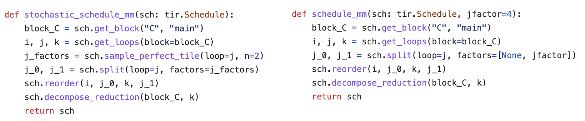
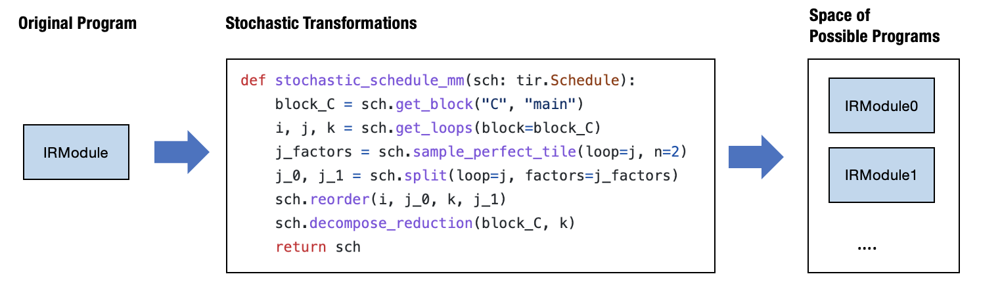
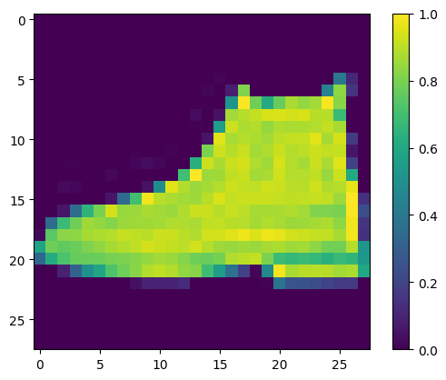
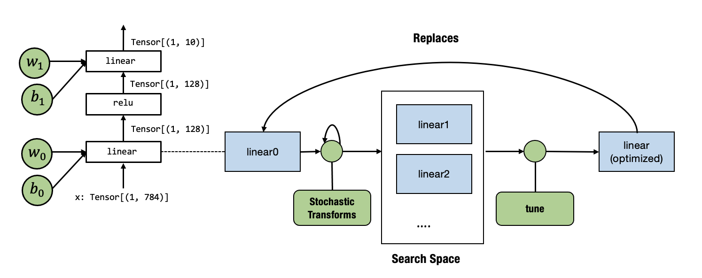

# 自动化程序优化

## 4.1. 前言

在过去的章节中，我们学习了如何构建元张量函数并将它们连接起来以进行端到端的模型执行。到目前为止，我们使用了三种主要的抽象类型。

- 驱动高层执行的计算图抽象
- 元张量函数的抽象
- 通过注册环境函数从而能被调用的库函数

所有这些元素都封装在一个 IRModule 中。大多数 MLC 过程可以看作是元张量函数之间的变换。

有许多不同的方法可以变换同一个程序。本章将讨论自动化一些流程的方法。

## 4.2. 准备工作

首先，我们将导入必要的依赖项并创建辅助函数。

```python
# This is needed for deferring annotation parsing in TVMScript
from __future__ import annotations
import numpy as np
import tvm
from tvm import relax
from tvm.ir.module import IRModule
from tvm.script import relax as R
from tvm.script import tir as T
```

```python
import IPython


def code2html(code):
    """Helper function to use pygments to turn the code string into highlighted html."""
    import pygments
    from pygments.formatters import HtmlFormatter
    from pygments.lexers import Python3Lexer
    formatter = HtmlFormatter()
    html = pygments.highlight(code, Python3Lexer(), formatter)
    return "<style>%s</style>%s\n" % (formatter.get_style_defs(".highlight"), html)
```

## 4.3. 回顾：变换元张量函数

让我们首先回顾一下我们在前几章中所做的事情——变换单个元张量函数。

```python
@tvm.script.ir_module
class MyModule:
    @T.prim_func
    def main(
        A: T.Buffer[(128, 128), "float32"],
        B: T.Buffer[(128, 128), "float32"],
        C: T.Buffer[(128, 128), "float32"],
    ):
        T.func_attr({"global_symbol": "main", "tir.noalias": True})
        for i, j, k in T.grid(128, 128, 128):
            with T.block("C"):
                vi, vj, vk = T.axis.remap("SSR", [i, j, k])
                with T.init():
                    C[vi, vj] = 0.0
                C[vi, vj] = C[vi, vj] + A[vi, vk] * B[vk, vj]
```

首先，让我们定义一组用于测试评估的输入输出。

```python
dtype = "float32"
a_np = np.random.rand(128, 128).astype(dtype)
b_np = np.random.rand(128, 128).astype(dtype)
c_mm = a_np @ b_np
```

我们可以如下构建和运行 `MyModule`。

```python
a_nd = tvm.nd.array(a_np)
b_nd = tvm.nd.array(b_np)
c_nd = tvm.nd.empty((128, 128), dtype="float32")

lib = tvm.build(MyModule, target="llvm")
f_timer_before = lib.time_evaluator("main", tvm.cpu())
print("Time cost of MyModule: %.3f ms" % (f_timer_before(a_nd, b_nd, c_nd).mean * 1000))
```

```
Time cost of MyModule: 4.912 ms
```

接下来，我们通过重新组织循环访问模式来稍微变换 `MyModule`。

```python
def schedule_mm(sch: tvm.tir.Schedule, jfactor=4):
    block_C = sch.get_block("C", "main")
    i, j, k = sch.get_loops(block=block_C)
    j_0, j_1 = sch.split(loop=j, factors=[None, jfactor])
    sch.reorder(i, j_0, k, j_1)
    sch.decompose_reduction(block_C, k)
    return sch
```

```python
sch = tvm.tir.Schedule(MyModule)
sch = schedule_mm(sch)
IPython.display.HTML(code2html(sch.mod.script()))
```

```python
@tvm.script.ir_module
class Module:
    @T.prim_func
    def main(A: T.Buffer[(128, 128), "float32"], B: T.Buffer[(128, 128), "float32"], C: T.Buffer[(128, 128), "float32"]) -> None:
        # function attr dict
        T.func_attr({"global_symbol": "main", "tir.noalias": True})
        # body
        # with T.block("root")
        for i, j_0 in T.grid(128, 32):
            for j_1_init in T.serial(4):
                with T.block("C_init"):
                    vi = T.axis.spatial(128, i)
                    vj = T.axis.spatial(128, j_0 * 4 + j_1_init)
                    T.reads()
                    T.writes(C[vi, vj])
                    C[vi, vj] = T.float32(0)
            for k, j_1 in T.grid(128, 4):
                with T.block("C_update"):
                    vi = T.axis.spatial(128, i)
                    vj = T.axis.spatial(128, j_0 * 4 + j_1)
                    vk = T.axis.reduce(128, k)
                    T.reads(C[vi, vj], A[vi, vk], B[vk, vj])
                    T.writes(C[vi, vj])
                    C[vi, vj] = C[vi, vj] + A[vi, vk] * B[vk, vj]
```

然后我们可以构建并运行重新组织后的程序。

```python
lib = tvm.build(sch.mod, target="llvm")
f_timer_after = lib.time_evaluator("main", tvm.cpu())
print("Time cost of MyModule=>schedule_mm: %.3f ms" % (f_timer_after(a_nd, b_nd, c_nd).mean * 1000))
```

```
Time cost of MyModule=>schedule_mm: 1.969 ms
```

### 4.3.1. 变换的历史轨迹

除了 `sch.mod`，`tir.Schedule` 提供的另一个数据结构是**历史轨迹** (trace)，它包含了 IRModule 在变换过程中所涉及的步骤。我们可以使用以下代码将其打印出来。

```python
print(sch.trace)
```

```python
b0 = sch.get_block(name="C", func_name="main")
l1, l2, l3 = sch.get_loops(block=b0)
l4, l5 = sch.split(loop=l2, factors=[None, 4], preserve_unit_iters=True)
sch.reorder(l1, l4, l3, l5)
b6 = sch.decompose_reduction(block=b0, loop=l3)
def schedule_mm(sch: tvm.tir.Schedule, jfactor=4):
    block_C = sch.get_block("C", "main")
    i, j, k = sch.get_loops(block=block_C)
    j_0, j_1 = sch.split(loop=j, factors=[None, jfactor])
    sch.reorder(i, j_0, k, j_1)
    sch.decompose_reduction(block_C, k)
    return sch
```

上面的历史轨迹与我们在 `schedule_mm` 中指定的变换一致。需要注意的一点是，历史轨迹加上原始程序一起，为我们提供了一种能够完全重新生成最终输出程序的方法。记住这一点，我们将在本章中使用历史轨迹作为检查变换的另一种方式。

## 4.4. 随机调度变换 (Stochastic Schedule Transformation)

到目前为止，我们已经详细说明了我们想要对原始 TensorIR 程序进行哪些变换。其中许多选择基于我们对底层环境的理解，例如缓存和硬件单元。

然而，在实践中，我们可能无法准确地决定每一个细节。因而，我们想指定**什么是变换程序的可能方法，同时省略一些细节**。

实现目标的一种自然方法是在我们的变换中添加一些随机元素。下面的代码就是这样做的。

```python
def stochastic_schedule_mm(sch: tvm.tir.Schedule):
    block_C = sch.get_block("C", "main")
    i, j, k = sch.get_loops(block=block_C)
    j_factors = sch.sample_perfect_tile(loop=j, n=2)
    j_0, j_1 = sch.split(loop=j, factors=j_factors)
    sch.reorder(i, j_0, k, j_1)
    sch.decompose_reduction(block_C, k)
    return sch
```



让我们对比 `stochastic_schedule_mm` 和 `schedule_mm`。可以发现，它们唯一的区别是指定 `j_factors` 的方式。在 `schedule_mm` 中， `j_factors` 作为我们指定的参数传入。在 `stochastic_schedule_mm` 中，它来自 `sch.sample_perfect_tile`。

顾名思义，`sch.sample_perfect_tile` 尝试使用随机数来作为 `j_factors` 的值。它在输入循环的长度的因子中进行采样，以便采样结果能完美地分割循环。例如，当原始循环长度为 `128` 时，拆分循环的可能方式包括：`[8, 16]`、`[32, 4]`、`[2, 64]`（注意 `8 * 16 = 32 * 4 = 2 * 64 = 128`）。

我们首先通过运行以下代码块来尝试查看 `stochastic_schedule_mm` 的效果。尝试多次运行以下代码块并观察结果差异。你可能会发现每次运行代码块时， `j_1` 的循环边界都会发生变化。

```python
sch = tvm.tir.Schedule(MyModule)
sch = stochastic_schedule_mm(sch)

IPython.display.HTML(code2html(sch.mod.script()))
```

```python
@tvm.script.ir_module
class Module:
    @T.prim_func
    def main(A: T.Buffer[(128, 128), "float32"], B: T.Buffer[(128, 128), "float32"], C: T.Buffer[(128, 128), "float32"]) -> None:
        # function attr dict
        T.func_attr({"global_symbol": "main", "tir.noalias": True})
        # body
        # with T.block("root")
        for i, j_0 in T.grid(128, 128):
            for j_1_init in T.serial(1):
                with T.block("C_init"):
                    vi = T.axis.spatial(128, i)
                    vj = T.axis.spatial(128, j_1_init + j_0)
                    T.reads()
                    T.writes(C[vi, vj])
                    C[vi, vj] = T.float32(0)
            for k, j_1 in T.grid(128, 1):
                with T.block("C_update"):
                    vi = T.axis.spatial(128, i)
                    vj = T.axis.spatial(128, j_1 + j_0)
                    vk = T.axis.reduce(128, k)
                    T.reads(C[vi, vj], A[vi, vk], B[vk, vj])
                    T.writes(C[vi, vj])
                    C[vi, vj] = C[vi, vj] + A[vi, vk] * B[vk, vj]
```

这里发生的是，每次我们运行 `stochastic_schedule_mm` 时，它都会随机采样一组不同的 `j_factors`。我们可以打印出最新的历史轨迹，以查看我们在采样中做出的决定。

```python
print(sch.trace)
```

```python
b0 = sch.get_block(name="C", func_name="main")
l1, l2, l3 = sch.get_loops(block=b0)
v4, v5 = sch.sample_perfect_tile(loop=l2, n=2, max_innermost_factor=16, decision=[128, 1])
l6, l7 = sch.split(loop=l2, factors=[v4, v5], preserve_unit_iters=True)
sch.reorder(l1, l6, l3, l7)
b8 = sch.decompose_reduction(block=b0, loop=l3)
```

当我们查看历史轨迹时，请密切注意 `sample_perfect_tile` 的 `decision=[...]` 部分。 它们对应于我们上次调用 `stochastic_schedule_mm` 时 `sampling_perfect_tile` 返回的值。

作为查看 `stochastic_schedule_mm` 不同采样结果的另一种方法，我们可以多次运行以下代码块并查看历史轨迹。

```python
sch = tvm.tir.Schedule(MyModule)
sch = stochastic_schedule_mm(sch)
print(sch.trace)
```

```python
b0 = sch.get_block(name="C", func_name="main")
l1, l2, l3 = sch.get_loops(block=b0)
v4, v5 = sch.sample_perfect_tile(loop=l2, n=2, max_innermost_factor=16, decision=[16, 8])
l6, l7 = sch.split(loop=l2, factors=[v4, v5], preserve_unit_iters=True)
sch.reorder(l1, l6, l3, l7)
b8 = sch.decompose_reduction(block=b0, loop=l3)
```

### 4.4.1. 深入研究随机变换

现在让我们更深入地研究随机调度变换中发生的事情。我们可以发现它是原始确定性变换的简单泛化，包含两个附加元素：

- 来自 `sample_perfect_tile` 的随机变量和我们在示例中未涵盖的其他采样操作。
- 利用随机变量进行的后续变换操作。

让我们尝试逐步运行随机变换。

```python
sch = tvm.tir.Schedule(MyModule)
block_C = sch.get_block("C", "main")
i, j, k = sch.get_loops(block=block_C)
j_factors = sch.sample_perfect_tile(loop=j, n=2)
```

```python
type(j_factors[0])
```

```python
tvm.tir.expr.Var
```

`j_factors` 中的元素并不是实整数。相反，它们是指被采样的随机变量的**符号变量**。我们可以将这些变量传递给变换的 API 从而指定诸如因子值之类的选择。

```python
print(sch.trace)
```

```python
b0 = sch.get_block(name="C", func_name="main")
l1, l2, l3 = sch.get_loops(block=b0)
v4, v5 = sch.sample_perfect_tile(loop=l2, n=2, max_innermost_factor=16, decision=[32, 4])
```

调度的历史轨迹在 `decisions` 字段中记录这些符号变量的选择。因此后续步骤将能够查找这些选择来决定如何拆分循环。

```python
IPython.display.HTML(code2html(sch.mod.script()))
```

```python
@tvm.script.ir_module
class Module:
    @T.prim_func
    def main(A: T.Buffer[(128, 128), "float32"], B: T.Buffer[(128, 128), "float32"], C: T.Buffer[(128, 128), "float32"]) -> None:
        # function attr dict
        T.func_attr({"global_symbol": "main", "tir.noalias": True})
        # body
        # with T.block("root")
        for i, j, k in T.grid(128, 128, 128):
            with T.block("C"):
                vi, vj, vk = T.axis.remap("SSR", [i, j, k])
                T.reads(A[vi, vk], B[vk, vj])
                T.writes(C[vi, vj])
                with T.init():
                    C[vi, vj] = T.float32(0)
                C[vi, vj] = C[vi, vj] + A[vi, vk] * B[vk, vj]
```

如果我们查看当前时间点的代码，我们可以发现 IRModule 保持不变，因为我们只对随机变量进行了采样，但还没有基于它们进行任何变换操作。

现在让我们采取一些行动：

```python
j_0, j_1 = sch.split(loop=j, factors=j_factors)
sch.reorder(i, j_0, k, j_1)
```

这些操作被记录在以下历史轨迹中。

```python
print(sch.trace)
```

```python
b0 = sch.get_block(name="C", func_name="main")
l1, l2, l3 = sch.get_loops(block=b0)
v4, v5 = sch.sample_perfect_tile(loop=l2, n=2, max_innermost_factor=16, decision=[32, 4])
l6, l7 = sch.split(loop=l2, factors=[v4, v5], preserve_unit_iters=True)
sch.reorder(l1, l6, l3, l7)
```

如果我们重新查看代码，变换后的模块现在对应于执行操作后的更新版本。

```
IPython.display.HTML(code2html(sch.mod.script()))
```

```python
@tvm.script.ir_module
class Module:
    @T.prim_func
    def main(A: T.Buffer[(128, 128), "float32"], B: T.Buffer[(128, 128), "float32"], C: T.Buffer[(128, 128), "float32"]) -> None:
        # function attr dict
        T.func_attr({"global_symbol": "main", "tir.noalias": True})
        # body
        # with T.block("root")
        for i, j_0, k, j_1 in T.grid(128, 32, 128, 4):
            with T.block("C"):
                vi = T.axis.spatial(128, i)
                vj = T.axis.spatial(128, j_0 * 4 + j_1)
                vk = T.axis.reduce(128, k)
                T.reads(A[vi, vk], B[vk, vj])
                T.writes(C[vi, vj])
                with T.init():
                    C[vi, vj] = T.float32(0)
                C[vi, vj] = C[vi, vj] + A[vi, vk] * B[vk, vj]
```

我们可以做一些进一步的变换以达到最终状态。

```python
sch.reorder(i, j_0, k, j_1)
sch.decompose_reduction(block_C, k)
```

```python
tir.BlockRV(0x5638d100eba0)
IPython.display.HTML(code2html(sch.mod.script()))
```

```python
@tvm.script.ir_module
class Module:
    @T.prim_func
    def main(A: T.Buffer[(128, 128), "float32"], B: T.Buffer[(128, 128), "float32"], C: T.Buffer[(128, 128), "float32"]) -> None:
        # function attr dict
        T.func_attr({"global_symbol": "main", "tir.noalias": True})
        # body
        # with T.block("root")
        for i, j_0 in T.grid(128, 32):
            for j_1_init in T.serial(4):
                with T.block("C_init"):
                    vi = T.axis.spatial(128, i)
                    vj = T.axis.spatial(128, j_0 * 4 + j_1_init)
                    T.reads()
                    T.writes(C[vi, vj])
                    C[vi, vj] = T.float32(0)
            for k, j_1 in T.grid(128, 4):
                with T.block("C_update"):
                    vi = T.axis.spatial(128, i)
                    vj = T.axis.spatial(128, j_0 * 4 + j_1)
                    vk = T.axis.reduce(128, k)
                    T.reads(C[vi, vj], A[vi, vk], B[vk, vj])
                    T.writes(C[vi, vj])
                    C[vi, vj] = C[vi, vj] + A[vi, vk] * B[vk, vj]
```

## 4.5. 随机变换搜索

你可能会意识到，`stochastic_schedule_mm` 创建了一个**可能程序的搜索空间**，具体取决于在每个采样步骤中做出的具体决定。



回到我们最初的直觉，我们希望能够指定一组**可能的程序**而不是一个程序。 `stochastic_schedule_mm` 正是这样做的。当然，接下来要问的一个很自然的问题是：什么是最佳选择？

我们需要一个搜索算法来做到这一点。为了展示这里可以做什么，让我们首先在下面的代码块中尝试最直接的搜索算法——随机搜索。它尝试重复运行 `stochastic_schedule_mm`，获取转换后的模块，运行测试，然后保留历史上最好（用时最短）的模块。

```python
def random_search(mod: tvm.IRModule, num_trials=5):
    best_result = None
    best_sch = None

    for i in range(num_trials):
        sch = stochastic_schedule_mm(tvm.tir.Schedule(mod))
        lib = tvm.build(sch.mod, target="llvm")
        f_timer_after = lib.time_evaluator("main", tvm.cpu())
        result = f_timer_after(a_nd, b_nd, c_nd).mean

        print("=====Attempt %d, time-cost: %.3f ms====" % (i, result * 1000))
        print(sch.trace)

        # book keep the best result so far
        if best_result is None or result < best_result:
            best_result = result
            best_sch = sch

    return best_sch

sch = random_search(MyModule)
```

```
=====Attempt 0, time-cost: 1.930 ms====
b0 = sch.get_block(name="C", func_name="main")
l1, l2, l3 = sch.get_loops(block=b0)
v4, v5 = sch.sample_perfect_tile(loop=l2, n=2, max_innermost_factor=16, decision=[32, 4])
l6, l7 = sch.split(loop=l2, factors=[v4, v5], preserve_unit_iters=True)
sch.reorder(l1, l6, l3, l7)
b8 = sch.decompose_reduction(block=b0, loop=l3)
=====Attempt 1, time-cost: 1.674 ms====
b0 = sch.get_block(name="C", func_name="main")
l1, l2, l3 = sch.get_loops(block=b0)
v4, v5 = sch.sample_perfect_tile(loop=l2, n=2, max_innermost_factor=16, decision=[16, 8])
l6, l7 = sch.split(loop=l2, factors=[v4, v5], preserve_unit_iters=True)
sch.reorder(l1, l6, l3, l7)
b8 = sch.decompose_reduction(block=b0, loop=l3)
=====Attempt 2, time-cost: 1.636 ms====
b0 = sch.get_block(name="C", func_name="main")
l1, l2, l3 = sch.get_loops(block=b0)
v4, v5 = sch.sample_perfect_tile(loop=l2, n=2, max_innermost_factor=16, decision=[16, 8])
l6, l7 = sch.split(loop=l2, factors=[v4, v5], preserve_unit_iters=True)
sch.reorder(l1, l6, l3, l7)
b8 = sch.decompose_reduction(block=b0, loop=l3)
=====Attempt 3, time-cost: 2.144 ms====
b0 = sch.get_block(name="C", func_name="main")
l1, l2, l3 = sch.get_loops(block=b0)
v4, v5 = sch.sample_perfect_tile(loop=l2, n=2, max_innermost_factor=16, decision=[32, 4])
l6, l7 = sch.split(loop=l2, factors=[v4, v5], preserve_unit_iters=True)
sch.reorder(l1, l6, l3, l7)
b8 = sch.decompose_reduction(block=b0, loop=l3)
=====Attempt 4, time-cost: 3.435 ms====
b0 = sch.get_block(name="C", func_name="main")
l1, l2, l3 = sch.get_loops(block=b0)
v4, v5 = sch.sample_perfect_tile(loop=l2, n=2, max_innermost_factor=16, decision=[64, 2])
l6, l7 = sch.split(loop=l2, factors=[v4, v5], preserve_unit_iters=True)
sch.reorder(l1, l6, l3, l7)
b8 = sch.decompose_reduction(block=b0, loop=l3)
```

如果我们运行代码，我们会发现它经过了几个选择，然后在五次试验中返回了最佳运行。

```python
print(sch.trace)
```

```python
b0 = sch.get_block(name="C", func_name="main")
l1, l2, l3 = sch.get_loops(block=b0)
v4, v5 = sch.sample_perfect_tile(loop=l2, n=2, max_innermost_factor=16, decision=[16, 8])
l6, l7 = sch.split(loop=l2, factors=[v4, v5], preserve_unit_iters=True)
sch.reorder(l1, l6, l3, l7)
b8 = sch.decompose_reduction(block=b0, loop=l3)
```

在实践中，我们使用更智能的算法。如果我们对其它设备的优化感兴趣，我们还需要提供额外的工具，例如远程设备上的基准测试。 TVM 的 Meta-Schedule API 提供了这些附加功能。

`meta_schedule` 是支持搜索可能变换空间的命名空间。Meta-Schedule 在幕后做了很多额外的事情：

- 跨越多个进程的并行基准测试。
- 使用**代价模型** (cost model) 来避免每次都进行基准测试。
- 基于历史轨迹进行**遗传搜索** (evolutionary search)，而不是每次都随机采样。

尽管有这些工具，但我们关键思想是保持不变的：**使用随机变换来指定好的程序的搜索空间，使用 ``tune_tir`` API 帮助在搜索空间内搜索并找到最优的调度变换**。

```python
from tvm import meta_schedule as ms

sch_tuned = ms.tune_tir(
    mod=MyModule,
    target="llvm --num-cores=1",
    config=ms.TuneConfig(
      max_trials_global=64,
      num_trials_per_iter=64,
    ),
    space=ms.space_generator.ScheduleFn(stochastic_schedule_mm),
    work_dir="./tune_tmp",
    task_name="main"
)
```

```
2022-08-27 13:29:41.332 INFO Logging directory: ./tune_tmp/logs
2022-08-27 13:29:41.335 INFO Logging directory: ./tune_tmp/logs
2022-08-27 13:29:41.337 INFO Working directory: ./tune_tmp
2022-08-27 13:29:41.339 INFO Creating JSONDatabase. Workload at: ./tune_tmp/database_workload.json. Tuning records at: ./tune_tmp/database_tuning_record.json
2022-08-27 13:29:41.342 INFO LocalBuilder: max_workers = 2
2022-08-27 13:29:42.021 INFO LocalRunner: max_workers = 1
2022-08-27 13:29:42.631 INFO Initializing Task #0: "main"
2022-08-27 13:29:42.645 INFO
 ID | Name |    FLOP | Weight | Speed (GFLOPS) | Latency (us) | Weighted Latency (us) | Trials | Terminated
------------------------------------------------------------------------------------------------------------
  0 | main | 4194304 |      1 |            N/A |          N/A |                   N/A |      0 |
------------------------------------------------------------------------------------------------------------
Total trials: 0
Total latency (us): 0

2022-08-27 13:29:42.646 INFO Scheduler picks Task #0: "main"
2022-08-27 13:29:47.532 INFO Sending 5 sample(s) to builder
2022-08-27 13:29:48.628 INFO Sending 5 sample(s) to runner
/usr/share/miniconda/envs/mlc/lib/python3.8/site-packages/xgboost/compat.py:36: FutureWarning: pandas.Int64Index is deprecated and will be removed from pandas in a future version. Use pandas.Index with the appropriate dtype instead.
  from pandas import MultiIndex, Int64Index
/usr/share/miniconda/envs/mlc/lib/python3.8/site-packages/xgboost/training.py:17: UserWarning: Old style callback is deprecated.  See: https://xgboost.readthedocs.io/en/latest/python/callbacks.html
  warnings.warn(f'Old style callback is deprecated.  See: {link}', UserWarning)
2022-08-27 13:29:51.499 INFO [Updated] Task #0: "main"
 ID | Name |    FLOP | Weight | Speed (GFLOPS) | Latency (us) | Weighted Latency (us) | Trials | Terminated
------------------------------------------------------------------------------------------------------------
  0 | main | 4194304 |      1 |         2.8612 |    1465.9074 |             1465.9074 |      5 |
------------------------------------------------------------------------------------------------------------
Total trials: 5
Total latency (us): 1465.91

2022-08-27 13:29:51.501 INFO Scheduler picks Task #0: "main"
2022-08-27 13:29:56.452 INFO Sending 0 sample(s) to builder
2022-08-27 13:29:56.461 INFO Sending 0 sample(s) to runner
2022-08-27 13:29:56.463 INFO [Updated] Task #0: "main"
 ID | Name |    FLOP | Weight | Speed (GFLOPS) | Latency (us) | Weighted Latency (us) | Trials | Terminated
------------------------------------------------------------------------------------------------------------
  0 | main | 4194304 |      1 |         2.8612 |    1465.9074 |             1465.9074 |      5 |
------------------------------------------------------------------------------------------------------------
Total trials: 5
Total latency (us): 1465.91

2022-08-27 13:29:56.465 INFO Scheduler picks Task #0: "main"
2022-08-27 13:30:01.027 INFO Sending 0 sample(s) to builder
2022-08-27 13:30:01.033 INFO Sending 0 sample(s) to runner
2022-08-27 13:30:01.035 INFO [Updated] Task #0: "main"
 ID | Name |    FLOP | Weight | Speed (GFLOPS) | Latency (us) | Weighted Latency (us) | Trials | Terminated
------------------------------------------------------------------------------------------------------------
  0 | main | 4194304 |      1 |         2.8612 |    1465.9074 |             1465.9074 |      5 |
------------------------------------------------------------------------------------------------------------
Total trials: 5
Total latency (us): 1465.91

2022-08-27 13:30:01.037 INFO Scheduler picks Task #0: "main"
2022-08-27 13:30:05.363 INFO Sending 0 sample(s) to builder
2022-08-27 13:30:05.368 INFO Sending 0 sample(s) to runner
2022-08-27 13:30:05.370 INFO [Updated] Task #0: "main"
 ID | Name |    FLOP | Weight | Speed (GFLOPS) | Latency (us) | Weighted Latency (us) | Trials | Terminated
------------------------------------------------------------------------------------------------------------
  0 | main | 4194304 |      1 |         2.8612 |    1465.9074 |             1465.9074 |      5 |
------------------------------------------------------------------------------------------------------------
Total trials: 5
Total latency (us): 1465.91

2022-08-27 13:30:05.371 INFO Scheduler picks Task #0: "main"
2022-08-27 13:30:09.471 INFO Sending 0 sample(s) to builder
2022-08-27 13:30:09.477 INFO Sending 0 sample(s) to runner
2022-08-27 13:30:09.479 INFO [Updated] Task #0: "main"
 ID | Name |    FLOP | Weight | Speed (GFLOPS) | Latency (us) | Weighted Latency (us) | Trials | Terminated
------------------------------------------------------------------------------------------------------------
  0 | main | 4194304 |      1 |         2.8612 |    1465.9074 |             1465.9074 |      5 |
------------------------------------------------------------------------------------------------------------
Total trials: 5
Total latency (us): 1465.91

2022-08-27 13:30:09.480 INFO Scheduler picks Task #0: "main"
2022-08-27 13:30:13.579 INFO Task #0 has finished. Remaining task(s): 0
2022-08-27 13:30:13.601 INFO Saved XGBModel to ./tune_tmp/cost_model.xgb
```

`tune_tir` 函数返回在调优过程中找到的优化后的调度。

```python
print(sch_tuned.trace)
```

```python
b0 = sch.get_block(name="C", func_name="main")
l1, l2, l3 = sch.get_loops(block=b0)
v4, v5 = sch.sample_perfect_tile(loop=l2, n=2, max_innermost_factor=16, decision=[8, 16])
l6, l7 = sch.split(loop=l2, factors=[v4, v5], preserve_unit_iters=True)
sch.reorder(l1, l6, l3, l7)
b8 = sch.decompose_reduction(block=b0, loop=l3)
sch.enter_postproc()
```

```python
IPython.display.HTML(code2html(sch_tuned.mod.script()))
```

```python
@tvm.script.ir_module
class Module:
    @T.prim_func
    def main(A: T.Buffer[(128, 128), "float32"], B: T.Buffer[(128, 128), "float32"], C: T.Buffer[(128, 128), "float32"]) -> None:
        # function attr dict
        T.func_attr({"global_symbol": "main", "tir.noalias": True})
        # body
        # with T.block("root")
        for i, j_0 in T.grid(128, 8):
            for j_1_init in T.serial(16):
                with T.block("C_init"):
                    vi = T.axis.spatial(128, i)
                    vj = T.axis.spatial(128, j_0 * 16 + j_1_init)
                    T.reads()
                    T.writes(C[vi, vj])
                    C[vi, vj] = T.float32(0)
            for k, j_1 in T.grid(128, 16):
                with T.block("C_update"):
                    vi = T.axis.spatial(128, i)
                    vj = T.axis.spatial(128, j_0 * 16 + j_1)
                    vk = T.axis.reduce(128, k)
                    T.reads(C[vi, vj], A[vi, vk], B[vk, vj])
                    T.writes(C[vi, vj])
                    C[vi, vj] = C[vi, vj] + A[vi, vk] * B[vk, vj]
lib = tvm.build(sch_tuned.mod, target="llvm")
f_timer_after = lib.time_evaluator("main", tvm.cpu())
print("Time cost of MyModule after tuning: %.3f ms" % (f_timer_after(a_nd, b_nd, c_nd).mean * 1000))
```

```
Time cost of MyModule after tuning: 1.301 ms
```

### 4.5.1. 利用默认的自动调度

在上一节中，我们展示了如何使用我们精心设计的随机变换来优化 IRModule 的计算。Meta-Schedule 带有内置通用随机变换集合，能够适用于广泛的 TensorIR 计算。这种方法也称为**自动调度** (auto-scheduling)，因为搜索空间是由系统生成的。我们可以通过删除行 `space=ms.space_generator.ScheduleFn(stochastic_schedule_mm)` 来运行它。

在底层，Meta-Schedule 分析每个 TensorIR block 的数据访问和循环模式，并提出对程序的随机变换方式。我们不会在本章中讨论这些通用的变换，但要注意它们也只是随机转换加上代码分析而已。我们可以使用上一节中学到的相同机制来增强自动调度。我们将在以后的章节中触及这个主题。

```python
sch_tuned = ms.tune_tir(
    mod=MyModule,
    target="llvm --num-cores=1",
    config=ms.TuneConfig(
      max_trials_global=64,
      num_trials_per_iter=64,
    ),
    work_dir="./tune_tmp",
    task_name="main",
)
```

```
2022-08-27 13:30:13.739 INFO Logging directory: ./tune_tmp/logs
2022-08-27 13:30:13.741 INFO Logging directory: ./tune_tmp/logs
2022-08-27 13:30:13.741 INFO Working directory: ./tune_tmp
2022-08-27 13:30:13.742 INFO Creating JSONDatabase. Workload at: ./tune_tmp/database_workload.json. Tuning records at: ./tune_tmp/database_tuning_record.json
2022-08-27 13:30:13.749 INFO LocalBuilder: max_workers = 2
2022-08-27 13:30:14.366 INFO LocalRunner: max_workers = 1
2022-08-27 13:30:14.986 INFO Initializing Task #0: "main"
2022-08-27 13:30:15.003 INFO
 ID | Name |    FLOP | Weight | Speed (GFLOPS) | Latency (us) | Weighted Latency (us) | Trials | Terminated
------------------------------------------------------------------------------------------------------------
  0 | main | 4194304 |      1 |            N/A |          N/A |                   N/A |      0 |
------------------------------------------------------------------------------------------------------------
Total trials: 0
Total latency (us): 0

2022-08-27 13:30:15.004 INFO Scheduler picks Task #0: "main"
2022-08-27 13:30:31.399 INFO Sending 64 sample(s) to builder
2022-08-27 13:30:59.058 INFO Sending 64 sample(s) to runner
/usr/share/miniconda/envs/mlc/lib/python3.8/site-packages/xgboost/training.py:17: UserWarning: Old style callback is deprecated.  See: https://xgboost.readthedocs.io/en/latest/python/callbacks.html
  warnings.warn(f'Old style callback is deprecated.  See: {link}', UserWarning)
2022-08-27 13:31:17.398 INFO [Updated] Task #0: "main"
 ID | Name |    FLOP | Weight | Speed (GFLOPS) | Latency (us) | Weighted Latency (us) | Trials | Terminated
------------------------------------------------------------------------------------------------------------
  0 | main | 4194304 |      1 |        19.4352 |     215.8092 |              215.8092 |     64 |
------------------------------------------------------------------------------------------------------------
Total trials: 64
Total latency (us): 215.809

2022-08-27 13:31:17.400 INFO Task #0 has finished. Remaining task(s): 0
2022-08-27 13:31:17.439 INFO Saved XGBModel to ./tune_tmp/cost_model.xgb
```

```python
lib = tvm.build(sch_tuned.mod, target="llvm")
f_timer_after = lib.time_evaluator("main", tvm.cpu())
print("Time cost of MyModule after tuning: %.3f ms" % (f_timer_after(a_nd, b_nd, c_nd).mean * 1000))
```

```
Time cost of MyModule after tuning: 0.203 ms
```

结果比我们的原始代码快得多。我们可以查看历史轨迹和最终代码。就本章而言，你不需要了解所有变换。在高层次的理解中，历史轨迹包含：

- 更多级的循环转换
- 中间计算的矢量化
- 并行化和循环展开

```python
sch_tuned.trace
```

```python
b0 = sch.get_block(name="C", func_name="main")
b1 = sch.get_block(name="root", func_name="main")
sch.annotate(block_or_loop=b0, ann_key="meta_schedule.tiling_structure", ann_val="SSRSRS")
l2, l3, l4 = sch.get_loops(block=b0)
v5, v6, v7, v8 = sch.sample_perfect_tile(loop=l2, n=4, max_innermost_factor=64, decision=[4, 1, 32, 1])
l9, l10, l11, l12 = sch.split(loop=l2, factors=[v5, v6, v7, v8], preserve_unit_iters=True)
v13, v14, v15, v16 = sch.sample_perfect_tile(loop=l3, n=4, max_innermost_factor=64, decision=[4, 1, 8, 4])
l17, l18, l19, l20 = sch.split(loop=l3, factors=[v13, v14, v15, v16], preserve_unit_iters=True)
v21, v22 = sch.sample_perfect_tile(loop=l4, n=2, max_innermost_factor=64, decision=[64, 2])
l23, l24 = sch.split(loop=l4, factors=[v21, v22], preserve_unit_iters=True)
sch.reorder(l9, l17, l10, l18, l23, l11, l19, l24, l12, l20)
b25 = sch.cache_write(block=b0, write_buffer_index=0, storage_scope="global")
sch.reverse_compute_at(block=b25, loop=l18, preserve_unit_loops=True)
sch.annotate(block_or_loop=b1, ann_key="meta_schedule.parallel", ann_val=16)
sch.annotate(block_or_loop=b1, ann_key="meta_schedule.vectorize", ann_val=64)
v26 = sch.sample_categorical(candidates=[0, 16, 64, 512], probs=[0.25, 0.25, 0.25, 0.25], decision=1)
sch.annotate(block_or_loop=b1, ann_key="meta_schedule.unroll_explicit", ann_val=v26)
sch.enter_postproc()
b27 = sch.get_block(name="root", func_name="main")
sch.unannotate(block_or_loop=b27, ann_key="meta_schedule.parallel")
sch.unannotate(block_or_loop=b27, ann_key="meta_schedule.vectorize")
sch.unannotate(block_or_loop=b27, ann_key="meta_schedule.unroll_explicit")
b28, b29 = sch.get_child_blocks(b27)
l30, l31, l32, l33, l34, l35, l36, l37, l38, l39 = sch.get_loops(block=b28)
l40 = sch.fuse(l30, l31, l32, l33, preserve_unit_iters=True)
sch.parallel(loop=l40)
l41 = sch.fuse(l39, preserve_unit_iters=True)
sch.vectorize(loop=l41)
sch.annotate(block_or_loop=l40, ann_key="pragma_auto_unroll_max_step", ann_val=16)
sch.annotate(block_or_loop=l40, ann_key="pragma_unroll_explicit", ann_val=1)
l42, l43, l44 = sch.get_loops(block=b29)
l45 = sch.fuse(l44, preserve_unit_iters=True)
sch.vectorize(loop=l45)
sch.annotate(block_or_loop=l42, ann_key="pragma_auto_unroll_max_step", ann_val=16)
sch.annotate(block_or_loop=l42, ann_key="pragma_unroll_explicit", ann_val=1)
b46 = sch.get_block(name="C", func_name="main")
l47, l48, l49, l50, l51, l52, l53 = sch.get_loops(block=b46)
b54 = sch.decompose_reduction(block=b46, loop=l48)
```

```python
IPython.display.HTML(code2html(sch_tuned.mod.script()))
```

```python
@tvm.script.ir_module
class Module:
    @T.prim_func
    def main(A: T.Buffer[(128, 128), "float32"], B: T.Buffer[(128, 128), "float32"], C: T.Buffer[(128, 128), "float32"]) -> None:
        # function attr dict
        T.func_attr({"global_symbol": "main", "tir.noalias": True})
        # body
        # with T.block("root")
        C_global = T.alloc_buffer([128, 128], dtype="float32")
        for i_0_j_0_i_1_j_1_fused in T.parallel(16, annotations={"pragma_auto_unroll_max_step":16, "pragma_unroll_explicit":1}):
            for i_2_init, j_2_init, i_3_init in T.grid(32, 8, 1):
                for j_3_fused_init in T.vectorized(4):
                    with T.block("C_init"):
                        vi = T.axis.spatial(128, i_3_init + i_0_j_0_i_1_j_1_fused // 4 * 32 + i_2_init)
                        vj = T.axis.spatial(128, i_0_j_0_i_1_j_1_fused % 4 * 32 + j_2_init * 4 + j_3_fused_init)
                        T.reads()
                        T.writes(C_global[vi, vj])
                        T.block_attr({"meta_schedule.tiling_structure":"SSRSRS"})
                        C_global[vi, vj] = T.float32(0)
            for k_0, i_2, j_2, k_1, i_3 in T.grid(64, 32, 8, 2, 1):
                for j_3_fused in T.vectorized(4):
                    with T.block("C_update"):
                        vi = T.axis.spatial(128, i_3 + i_0_j_0_i_1_j_1_fused // 4 * 32 + i_2)
                        vj = T.axis.spatial(128, i_0_j_0_i_1_j_1_fused % 4 * 32 + j_2 * 4 + j_3_fused)
                        vk = T.axis.reduce(128, k_0 * 2 + k_1)
                        T.reads(C_global[vi, vj], A[vi, vk], B[vk, vj])
                        T.writes(C_global[vi, vj])
                        T.block_attr({"meta_schedule.tiling_structure":"SSRSRS"})
                        C_global[vi, vj] = C_global[vi, vj] + A[vi, vk] * B[vk, vj]
            for ax0 in T.serial(32):
                for ax1_fused in T.vectorized(32):
                    with T.block("C_global"):
                        v0 = T.axis.spatial(128, i_0_j_0_i_1_j_1_fused // 4 * 32 + ax0)
                        v1 = T.axis.spatial(128, i_0_j_0_i_1_j_1_fused % 4 * 32 + ax1_fused)
                        T.reads(C_global[v0, v1])
                        T.writes(C[v0, v1])
                        C[v0, v1] = C_global[v0, v1]
```

### 4.5.2. 章节检查点

让我们对到目前为止所学的内容进行检查。

- 随机调度允许我们表示“可能的变换是什么”。
- Meta-Schedule 的 `tune_tir` API 帮助我们在搜索空间内找到一个好的解决方案。
- Meta-Schedule 带有一组默认的内置随机变换，涵盖了广泛的搜索空间。

## 4.6. 回到端到端模型执行

到目前为止，我们已经学会了自动优化单个元张量函数。我们如何才能把利用它改进我们的端到端模型执行？

从 MLC 的角度来看，自动搜索是一个模块化的步骤，我们只需要用调优结果提供的新的元张量函数实现替换原始的元张量函数实现。

我们将重用上一章中的两层 MLP 示例。

```python
import torch
import torchvision

test_data = torchvision.datasets.FashionMNIST(
    root="data",
    train=False,
    download=True,
    transform=torchvision.transforms.ToTensor()
)
test_loader = torch.utils.data.DataLoader(test_data, batch_size=1, shuffle=True)
class_names = ['T-shirt/top', 'Trouser', 'Pullover', 'Dress', 'Coat',
               'Sandal', 'Shirt', 'Sneaker', 'Bag', 'Ankle boot']

img, label = next(iter(test_loader))
img = img.reshape(1, 28, 28).numpy()
```

```
Downloading http://fashion-mnist.s3-website.eu-central-1.amazonaws.com/train-images-idx3-ubyte.gz
Downloading http://fashion-mnist.s3-website.eu-central-1.amazonaws.com/train-images-idx3-ubyte.gz to data/FashionMNIST/raw/train-images-idx3-ubyte.gz
100.0%
Extracting data/FashionMNIST/raw/train-images-idx3-ubyte.gz to data/FashionMNIST/raw

Downloading http://fashion-mnist.s3-website.eu-central-1.amazonaws.com/train-labels-idx1-ubyte.gz
Downloading http://fashion-mnist.s3-website.eu-central-1.amazonaws.com/train-labels-idx1-ubyte.gz to data/FashionMNIST/raw/train-labels-idx1-ubyte.gz
100.0%
Extracting data/FashionMNIST/raw/train-labels-idx1-ubyte.gz to data/FashionMNIST/raw

Downloading http://fashion-mnist.s3-website.eu-central-1.amazonaws.com/t10k-images-idx3-ubyte.gz
Downloading http://fashion-mnist.s3-website.eu-central-1.amazonaws.com/t10k-images-idx3-ubyte.gz to data/FashionMNIST/raw/t10k-images-idx3-ubyte.gz
100.0%
Extracting data/FashionMNIST/raw/t10k-images-idx3-ubyte.gz to data/FashionMNIST/raw

Downloading http://fashion-mnist.s3-website.eu-central-1.amazonaws.com/t10k-labels-idx1-ubyte.gz
Downloading http://fashion-mnist.s3-website.eu-central-1.amazonaws.com/t10k-labels-idx1-ubyte.gz to data/FashionMNIST/raw/t10k-labels-idx1-ubyte.gz
100.0%Extracting data/FashionMNIST/raw/t10k-labels-idx1-ubyte.gz to data/FashionMNIST/raw
```

```python
import matplotlib.pyplot as plt

plt.figure()
plt.imshow(img[0])
plt.colorbar()
plt.grid(False)
plt.show()

print("Class:", class_names[label[0]])
```




```
Class: Ankle boot
```

我们同样下载我们将在示例中使用的预训练模型参数。

```
# Hide outputs
!wget -nc https://github.com/mlc-ai/web-data/raw/main/models/fasionmnist_mlp_params.pkl
```


提醒一下，上面的图展示了我们用到的模型。

```python
import pickle as pkl

mlp_params = pkl.load(open("fasionmnist_mlp_params.pkl", "rb"))

data_nd = tvm.nd.array(img.reshape(1, 784))
nd_params = {k: tvm.nd.array(v) for k, v in mlp_params.items()}
```

让我们使用一个混合 IRModule。它其中大多数步骤都调用环境函数，同时带有一个 TensorIR 函数 `linear0`。

```python
@tvm.script.ir_module
class MyModuleMixture:
    @T.prim_func
    def linear0(X: T.Buffer[(1, 784), "float32"],
                W: T.Buffer[(128, 784), "float32"],
                B: T.Buffer[(128,), "float32"],
                Z: T.Buffer[(1, 128), "float32"]):
        T.func_attr({"global_symbol": "linear0", "tir.noalias": True})
        Y = T.alloc_buffer((1, 128), "float32")
        for i, j, k in T.grid(1, 128, 784):
            with T.block("Y"):
                vi, vj, vk = T.axis.remap("SSR", [i, j, k])
                with T.init():
                    Y[vi, vj] = T.float32(0)
                Y[vi, vj] = Y[vi, vj] + X[vi, vk] * W[vj, vk]

        for i, j in T.grid(1, 128):
            with T.block("Z"):
                vi, vj = T.axis.remap("SS", [i, j])
                Z[vi, vj] =  Y[vi, vj] + B[vj]

    @R.function
    def main(x: Tensor((1, 784), "float32"),
             w0: Tensor((128, 784), "float32"),
             b0: Tensor((128,), "float32"),
             w1: Tensor((10, 128), "float32"),
             b1: Tensor((10,), "float32")):
        with R.dataflow():
            lv0 = R.call_tir(linear0, (x, w0, b0), (1, 128), dtype="float32")
            lv1 = R.call_tir("env.relu", (lv0,), (1, 128), dtype="float32")
            out = R.call_tir("env.linear", (lv1, w1, b1), (1, 10), dtype="float32")
            R.output(out)
        return out
```

```python
@tvm.register_func("env.linear", override=True)
def torch_linear(x: tvm.nd.NDArray,
                 w: tvm.nd.NDArray,
                 b: tvm.nd.NDArray,
                 out: tvm.nd.NDArray):
    x_torch = torch.from_dlpack(x)
    w_torch = torch.from_dlpack(w)
    b_torch = torch.from_dlpack(b)
    out_torch = torch.from_dlpack(out)
    torch.mm(x_torch, w_torch.T, out=out_torch)
    torch.add(out_torch, b_torch, out=out_torch)

@tvm.register_func("env.relu", override=True)
def lnumpy_relu(x: tvm.nd.NDArray,
                out: tvm.nd.NDArray):
    x_torch = torch.from_dlpack(x)
    out_torch = torch.from_dlpack(out)
    torch.maximum(x_torch, torch.Tensor([0.0]), out=out_torch)
```

我们可以绑定参数，看看它是否给出了正确的预测。

```python
MyModuleWithParams = relax.transform.BindParams("main", nd_params)(MyModuleMixture)
```

```python
ex = relax.vm.build(MyModuleWithParams, target="llvm")
vm = relax.VirtualMachine(ex, tvm.cpu())

nd_res = vm["main"](data_nd)

pred_kind = np.argmax(nd_res.numpy(), axis=1)
print("MyModuleWithParams Prediction:", class_names[pred_kind[0]])
```

```
MyModuleWithParams Prediction: Ankle boot
```

以下代码计算模块在变化前的运行时间。请注意，因为这是一个小模型，不同次运行之间数字可能会有所波动，所以我们只需要关注整体幅度。

```python
ftimer = vm.module.time_evaluator("main", tvm.cpu(), number=100)

print("MyModuleWithParams time-cost: %g ms" % (ftimer(data_nd).mean * 1000))
```

```
MyModuleWithParams time-cost: 0.268523 ms
```

我们现在准备好调整 `linear0`。下图总结了我们的整个流程。



目前，调优 API 只接受一个带有一个 `main` 函数的 IRModule，所以我们首先将 `linear0` 取出到另一个模块的 main 函数中并将其传递给 `tune_tir`。

```python
mod_linear = tvm.IRModule.from_expr(MyModuleMixture["linear0"].with_attr("global_symbol", "main"))
IPython.display.HTML(code2html(mod_linear.script()))
```

```python
@tvm.script.ir_module
class Module:
    @T.prim_func
    def main(X: T.Buffer[(1, 784), "float32"], W: T.Buffer[(128, 784), "float32"], B: T.Buffer[128, "float32"], Z: T.Buffer[(1, 128), "float32"]) -> None:
        # function attr dict
        T.func_attr({"global_symbol": "main", "tir.noalias": True})
        # body
        # with T.block("root")
        Y = T.alloc_buffer([1, 128], dtype="float32")
        for i, j, k in T.grid(1, 128, 784):
            with T.block("Y"):
                vi, vj, vk = T.axis.remap("SSR", [i, j, k])
                T.reads(X[vi, vk], W[vj, vk])
                T.writes(Y[vi, vj])
                with T.init():
                    Y[vi, vj] = T.float32(0)
                Y[vi, vj] = Y[vi, vj] + X[vi, vk] * W[vj, vk]
        for i, j in T.grid(1, 128):
            with T.block("Z"):
                vi, vj = T.axis.remap("SS", [i, j])
                T.reads(Y[vi, vj], B[vj])
                T.writes(Z[vi, vj])
                Z[vi, vj] = Y[vi, vj] + B[vj]
sch_tuned_linear = ms.tune_tir(
    mod=mod_linear,
    target="llvm --num-cores=1",
    config=ms.TuneConfig(
      max_trials_global=64,
      num_trials_per_iter=64,
    ),
    work_dir="./tune_tmp",
    task_name="main",
)
```

```
2022-08-27 13:31:26.141 INFO Logging directory: ./tune_tmp/logs
2022-08-27 13:31:26.144 INFO Logging directory: ./tune_tmp/logs
2022-08-27 13:31:26.146 INFO Working directory: ./tune_tmp
2022-08-27 13:31:26.148 INFO Creating JSONDatabase. Workload at: ./tune_tmp/database_workload.json. Tuning records at: ./tune_tmp/database_tuning_record.json
2022-08-27 13:31:26.234 INFO LocalBuilder: max_workers = 2
2022-08-27 13:31:26.881 INFO LocalRunner: max_workers = 1
2022-08-27 13:31:27.515 INFO Initializing Task #0: "main"
2022-08-27 13:31:27.539 INFO
 ID | Name |   FLOP | Weight | Speed (GFLOPS) | Latency (us) | Weighted Latency (us) | Trials | Terminated
-----------------------------------------------------------------------------------------------------------
  0 | main | 200832 |      1 |            N/A |          N/A |                   N/A |      0 |
-----------------------------------------------------------------------------------------------------------
Total trials: 0
Total latency (us): 0

2022-08-27 13:31:27.540 INFO Scheduler picks Task #0: "main"
2022-08-27 13:31:43.210 INFO Sending 64 sample(s) to builder
2022-08-27 13:32:09.300 INFO Sending 64 sample(s) to runner
/usr/share/miniconda/envs/mlc/lib/python3.8/site-packages/xgboost/training.py:17: UserWarning: Old style callback is deprecated.  See: https://xgboost.readthedocs.io/en/latest/python/callbacks.html
  warnings.warn(f'Old style callback is deprecated.  See: {link}', UserWarning)
2022-08-27 13:32:28.306 INFO [Updated] Task #0: "main"
 ID | Name |   FLOP | Weight | Speed (GFLOPS) | Latency (us) | Weighted Latency (us) | Trials | Terminated
-----------------------------------------------------------------------------------------------------------
  0 | main | 200832 |      1 |         7.6530 |      26.2422 |               26.2422 |     64 |
-----------------------------------------------------------------------------------------------------------
Total trials: 64
Total latency (us): 26.2422

2022-08-27 13:32:28.308 INFO Task #0 has finished. Remaining task(s): 0
2022-08-27 13:32:28.346 INFO Saved XGBModel to ./tune_tmp/cost_model.xgb
```

现在我们需要在调优后用新函数替换原来的 `linear0`。我们可以通过首先获得一个 `global_var`（一个指向 IRModule 中函数的 `pointer` 引用），然后调用 `update_func` 来用新的函数替换原本的函数。

```python
MyModuleWithParams2 = relax.transform.BindParams("main", nd_params)(MyModuleMixture)
new_func = sch_tuned_linear.mod["main"].with_attr("global_symbol", "linear0")
gv = MyModuleWithParams2.get_global_var("linear0")
MyModuleWithParams2.update_func(gv, new_func)
IPython.display.HTML(code2html(MyModuleWithParams2.script()))
```

```python
@tvm.script.ir_module
class Module:
    @R.function
    def main(x: Tensor((1, 784), "float32")) -> Tensor(None, "float32", ndim = 2):
        # block 0
        with R.dataflow():
            lv0 = R.call_tir(linear0, (x, meta[relay.Constant][0], meta[relay.Constant][1]), (1, 128), dtype="float32")
            lv1 = R.call_tir("env.relu", (lv0,), (1, 128), dtype="float32")
            out = R.call_tir("env.linear", (lv1, meta[relay.Constant][2], meta[relay.Constant][3]), (1, 10), dtype="float32")
            R.output(out)
        return out

    @T.prim_func
    def linear0(X: T.Buffer[(1, 784), "float32"], W: T.Buffer[(128, 784), "float32"], B: T.Buffer[128, "float32"], Z: T.Buffer[(1, 128), "float32"]) -> None:
        # function attr dict
        T.func_attr({"global_symbol": "linear0", "tir.noalias": True})
        # body
        # with T.block("root")
        Y = T.alloc_buffer([1, 128], dtype="float32")
        for i_0 in T.serial(1, annotations={"pragma_auto_unroll_max_step":512, "pragma_unroll_explicit":1}):
            for j_0 in T.serial(1):
                for i_1, j_1 in T.grid(1, 8):
                    for i_2_init, j_2_init, i_3_init in T.grid(1, 8, 1):
                        for j_3_fused_init in T.vectorized(2):
                            with T.block("Y_init"):
                                vi = T.axis.spatial(1, i_0 + i_1 + i_2_init + i_3_init)
                                vj = T.axis.spatial(128, j_0 * 128 + j_1 * 16 + j_2_init * 2 + j_3_fused_init)
                                T.reads()
                                T.writes(Y[vi, vj])
                                T.block_attr({"meta_schedule.tiling_structure":"SSRSRS"})
                                Y[vi, vj] = T.float32(0)
                    for k_0, i_2, j_2, k_1, i_3 in T.grid(392, 1, 8, 2, 1):
                        for j_3_fused in T.vectorized(2):
                            with T.block("Y_update"):
                                vi = T.axis.spatial(1, i_0 + i_1 + i_2 + i_3)
                                vj = T.axis.spatial(128, j_0 * 128 + j_1 * 16 + j_2 * 2 + j_3_fused)
                                vk = T.axis.reduce(784, k_0 * 2 + k_1)
                                T.reads(Y[vi, vj], X[vi, vk], W[vj, vk])
                                T.writes(Y[vi, vj])
                                T.block_attr({"meta_schedule.tiling_structure":"SSRSRS"})
                                Y[vi, vj] = Y[vi, vj] + X[vi, vk] * W[vj, vk]
                for ax0, ax1 in T.grid(1, 128):
                    with T.block("Z"):
                        vi, vj = T.axis.remap("SS", [ax0, ax1])
                        T.reads(Y[vi, vj], B[vj])
                        T.writes(Z[vi, vj])
                        Z[vi, vj] = Y[vi, vj] + B[vj]
```

我们可以发现上面代码中的 `linear0` 已经被替换了。

```python
ex = relax.vm.build(MyModuleWithParams2, target="llvm")
vm = relax.VirtualMachine(ex, tvm.cpu())

nd_res = vm["main"](data_nd)

pred_kind = np.argmax(nd_res.numpy(), axis=1)
print("MyModuleWithParams2 Prediction:", class_names[pred_kind[0]])
```

```
MyModuleWithParams2 Prediction: Ankle boot
```

再次运行代码，我们可以发现我们得到了明显的时间减少，这主要归功于新的 `linear0` 函数。

```python
ftimer = vm.module.time_evaluator("main", tvm.cpu(), number=50)

print("MyModuleWithParams2 time-cost: %g ms" % (ftimer(data_nd).mean * 1000))
```

```
MyModuleWithParams2 time-cost: 0.103931 ms
```

## 4.7. 讨论

我们可能会注意到，我们前两章关注的是**抽象**，而本章开始关注**变换**。随机变换指定了可以优化的内容，而无需显式地确定所有选择。Meta-Schedule API 帮助我们搜索可能的变换空间并选择最佳变换。

重要的是，将搜索结果放回端到端流程只是将原始函数的实现替换为调优后的新函数的实现。

因此，我们再次遵循下图中的通用 MLC 流程。在以后的内容中，我们将介绍更多关于元张量函数和计算图函数的变换。一个好的 MLC 流程将这些变换组合在一起，形成最终部署的形式。


## 4.8. 概括

- 随机变换帮助我们指定可能程序的搜索空间。
- Meta-Schedule 在搜索空间中搜索，并找到优化后的程序。
- 我们可以使用另一种变换，将初始的元张量函数替换为优化后的函数，并更新端到端执行流程。