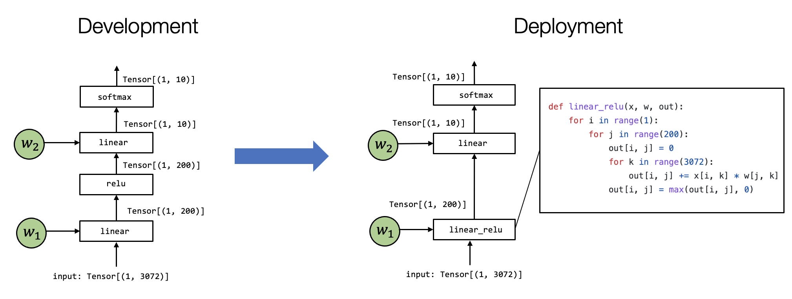
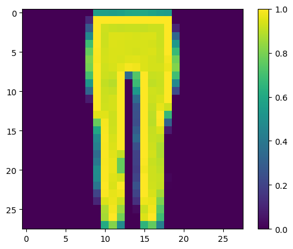

# 计算图优化

## 7.1. 前言

大多数 MLC 过程可以看作是张量函数之间的转换。 在过去的章节中，我们研究了如何单独变换每个元张量函数。 在本章中，让我们讨论计算图之间的高层变换。



## 7.2. 准备工作

首先，让我们导入必要的依赖项。

```python
# This is needed for deferring annotation parsing in TVMScript
from __future__ import annotations
import numpy as np
import tvm
from tvm import relax, topi
from tvm.ir.module import IRModule
from tvm.script import relax as R
from tvm.script import tir as T
```

## 7.3. 模式匹配和改写

首先，让我们从以下示例开始。

```python
@tvm.script.ir_module
class MyModule:
    @R.function
    def main(x: Tensor((3, 4), "float32"), y: Tensor((3, 4), "float32")):
        with relax.dataflow():
            lv0 = relax.multiply(x, y)
            gv0 = relax.add(lv0, y)
            relax.output(gv0)
        return gv0
```

`MyModule` 包含一个带有两个图层 op 的 relax 函数，其中包含 `relax.multiply` 和`relax.add`。我们的目标是找到这两个运算符并将它们替换为一个 `relax.ewise_fma` 运算符的调用。

在我们研究如何准确地做到这一点之前，让我们首先检查构成 `MyModule` 的数据结构。 每个 `IRModule` 都包含一组函数，函数体由一组称为抽象语法树（AST）的数据结构组成。

```python
relax_func = MyModule["main"]
```

每个函数都由一个 `relax.Function` 节点表示。

```python
type(relax_func)
```

```python
tvm.relax.expr.Function
```

该函数包含一系列参数：

```python
relax_func.params
```

```
[relax.expr.Var(0x55d91a472760), relax.expr.Var(0x55d919382550)]
```

该函数包含一个返回值表达式，和函数中的一组 binding blocks 。

```python
func_body = relax_func.body
type(func_body)
```

```python
tvm.relax.expr.SeqExpr
```

函数主体 `SeqExpr` 包含一系列 binding 。

```python
func_body.blocks
```

```
[relax.expr.DataflowBlock(0x55d919382f90)]
dataflow_block = func_body.blocks[0]
```

在我们的特定情况下，我们有一个数据流块，其中包含两个 Binding 。绑定对应于以下代码：

```python
lv0 = relax.multiply(x, y)
gv0 = relax.add(lv0, y)
```

```python
dataflow_block.bindings
```

```
[relax.expr.VarBinding(0x55d91a52cba0), relax.expr.VarBinding(0x55d91a32b780)]
binding = dataflow_block.bindings[0]
```

每个 binding 都有一个对应于绑定左侧的 var (`lv0`、`gv0`）。

```python
binding.var
```

```
relax.expr.DataflowVar(0x55d919383d90)
```

并且每个 binding 的右侧是他的 value。 每个 value 对应一个 `relax.Call` 节点，表示对元函数的调用。

```python
binding.value
```

```
CallNode(Op(relax.multiply), [relax.expr.Var(0x55d91a472760), relax.expr.Var(0x55d919382550)], (nullptr), [])
```


上图总结了这个特定函数所涉及的数据结构。

改写程序可以通过递归遍历 MyModule 的 AST ，并生成转换后的 AST 来实现。 我们当然可以直接使用构建AST的 python API 来做到这一点。 但是，我们可以使用额外的工具支持来简化流程。 下面的代码块遵循一种称为 **访问者模式 (visitor pattern)** 的设计模式，它允许我们访问每个 AST 节点并将它们重写为转换后的版本。

```python
@relax.expr_functor.mutator
class EwiseFMARewriter(relax.PyExprMutator):
    def visit_call_(self, call):
        call = self.visit_expr_post_order(call)
        add_op = tvm.ir.Op.get("relax.add")
        multiply_op = tvm.ir.Op.get("relax.multiply")
        ewise_fma_op = tvm.ir.Op.get("relax.ewise_fma")

        if call.op != add_op:
            return call

        value = self.lookup_binding(call.args[0])
        if not isinstance(value, relax.Call) or value.op != multiply_op:
            return call

        fma_call = relax.Call(
            ewise_fma_op, [value.args[0], value.args[1], call.args[1]], None, None
        )
        return fma_call


updated_fn = EwiseFMARewriter().visit_expr(MyModule["main"])
updated_fn.show()
```

```python
@R.function
def main(x: Tensor((3, 4), "float32"), y: Tensor((3, 4), "float32")) -> Tensor(None, "float32", ndim = 2):
    # block 0
    with R.dataflow():
        lv0: Tensor((3, 4), "float32") = relax.multiply(x, y)
        gv0: Tensor((3, 4), "float32") = relax.ewise_fma(x, y, y)
        R.output(gv0)
    return gv0
```

请注意，结果将 `gv0` 重写为融合运算符，但将 `lv0` 留在代码中。 我们可以使用 `remove_all_unused` 来进一步简化代码块。

```
relax.analysis.remove_all_unused(updated_fn).show()
```

```python
@R.function
def main(x: Tensor((3, 4), "float32"), y: Tensor((3, 4), "float32")) -> Tensor(None, "float32", ndim = 2):
    # block 0
    with R.dataflow():
        gv0: Tensor((3, 4), "float32") = relax.ewise_fma(x, y, y)
        R.output(gv0)
    return gv0
```

## 7.4. 融合 Linear 和 ReLU 算子

现在我们对计算图改写有了基本的了解，让我们在端到端模型上进行尝试。

```
# Hide outputs
!wget https://github.com/mlc-ai/web-data/raw/main/models/fasionmnist_mlp_params.pkl
```

```python
import pickle as pkl

mlp_params = pkl.load(open("fasionmnist_mlp_params.pkl", "rb"))
```

以下代码重新构建了我们在过去章节中使用的 FashionMNIST MLP 模型。 为了简化过程，我们直接使用高级运算符构建模型，例如 `relax.op.add` 和 `relax.op.dense`。

```python
def create_model():
    bb = relax.BlockBuilder()
    x = relax.Var("x", (1, 784), relax.DynTensorType(2, "float32"))
    w0 = relax.const(mlp_params["w0"], "float32")
    b0 = relax.const(mlp_params["b0"], "float32")
    w1 = relax.const(mlp_params["w1"], "float32")
    b1 = relax.const(mlp_params["b1"], "float32")

    with bb.function("main", [x]):
        with bb.dataflow():
            lv0 = bb.emit(relax.op.dense(x, w0))
            lv1 = bb.emit(relax.op.add(lv0, b0))
            lv2 = bb.emit(relax.op.relu(lv1))
            lv3 = bb.emit(relax.op.dense(lv2, w1))
            lv4 = bb.emit(relax.op.add(lv3, b1))
            gv = bb.emit_output(lv4)
        bb.emit_func_output(gv)

    return bb.get()

MLPModel = create_model()
MLPModel.show()
```

```python
@tvm.script.ir_module
class Module:
    @R.function
    def main(x: Tensor((1, 784), "float32")) -> Tensor(None, "float32", ndim = 2):
        # block 0
        with R.dataflow():
            lv: Tensor((1, 128), "float32") = relax.nn.dense(x, meta[relay.Constant][0])
            lv1: Tensor((1, 128), "float32") = relax.add(lv, meta[relay.Constant][1])
            lv2: Tensor((1, 128), "float32") = relax.nn.relu(lv1)
            lv3: Tensor((1, 10), "float32") = relax.nn.dense(lv2, meta[relay.Constant][2])
            lv4: Tensor((1, 10), "float32") = relax.add(lv3, meta[relay.Constant][3])
            gv: Tensor((1, 10), "float32") = lv4
            R.output(gv)
        return gv
```

我们的目标是“融合” `dense` 和 `add` 算子到一起。 以下代码通过以下步骤实现：

- 识别 `dense` 和 `add` 算子。
- 生成另一个调用 `dense` 和 `add` 算子的子函数。
- 将 `dense` 和 `add` 替换为融合后的子函数。

```python
@relax.expr_functor.mutator
class DenseAddFusor(relax.PyExprMutator):
    def __init__(self, mod: IRModule) -> None:
        super().__init__()
        self.mod_ = mod
        # cache pre-defined ops
        self.add_op = tvm.ir.Op.get("relax.add")
        self.dense_op = tvm.ir.Op.get("relax.nn.dense")
        self.counter = 0

    def transform(self) -> IRModule:
        for global_var, func in self.mod_.functions.items():
            if not isinstance(func, relax.Function):
                continue
            # avoid already fused primitive functions
            if "Primitive" in func.attrs.keys() and func.attrs["Primitive"] != 0:
                continue
            updated_func = self.visit_expr(func)
            updated_func = relax.analysis.remove_all_unused(updated_func)
            self.builder_.update_func(global_var, updated_func)

        return self.builder_.get()

    def visit_call_(self, call):
        call = self.visit_expr_post_order(call)

        def match_call(node, op):
            if not isinstance(node, relax.Call):
                return False
            return node.op == op

        # pattern match dense => add
        if not match_call(call, self.add_op):
            return call

        value = self.lookup_binding(call.args[0])
        if value is None:
            return call

        if not match_call(value, self.dense_op):
            return call

        x = value.args[0]
        w = value.args[1]
        b = call.args[1]

        # construct a new fused primitive function
        param_x = relax.Var("x", x.shape_, x._checked_type_)
        param_w = relax.Var("w", w.shape_, w._checked_type_)
        param_b = relax.Var("b", b.shape_, b._checked_type_)

        bb = relax.BlockBuilder()

        fn_name = "fused_dense_add%d" % (self.counter)
        self.counter += 1
        with bb.function(fn_name, [param_x, param_w, param_b]):
            with bb.dataflow():
                lv0 = bb.emit(relax.op.nn.dense(param_x, param_w))
                gv = bb.emit_output(relax.op.add(lv0, param_b))
            bb.emit_func_output(gv)

        # Add Primitive attribute to the fused funtions
        fused_fn = bb.get()[fn_name].with_attr("Primitive", 1)
        global_var = self.builder_.add_func(fused_fn, fn_name)

        # construct call into the fused function
        return relax.Call(global_var, [x, w, b], None, None)

@tvm.ir.transform.module_pass(opt_level=2, name="DeseAddFuse")
class FuseDenseAddPass:
    """The wrapper for the LowerTensorIR pass."""
    def transform_module(self, mod, ctx):
        return DenseAddFusor(mod).transform()


MLPFused = FuseDenseAddPass()(MLPModel)
MLPFused.show()
```

```python
@tvm.script.ir_module
class Module:
    @R.function
    def fused_dense_add0(x: Tensor((1, 784), "float32"), w: Tensor((128, 784), "float32"), b: Tensor((128,), "float32")) -> Tensor(None, "float32", ndim = 2):
        # block 0
        with R.dataflow():
            lv: Tensor((1, 128), "float32") = relax.nn.dense(x, w)
            gv: Tensor((1, 128), "float32") = relax.add(lv, b)
            R.output(gv)
        return gv

    @R.function
    def fused_dense_add1(x1: Tensor((1, 128), "float32"), w1: Tensor((10, 128), "float32"), b1: Tensor((10,), "float32")) -> Tensor(None, "float32", ndim = 2):
        # block 0
        with R.dataflow():
            lv1: Tensor((1, 10), "float32") = relax.nn.dense(x1, w1)
            gv1: Tensor((1, 10), "float32") = relax.add(lv1, b1)
            R.output(gv1)
        return gv1

    @R.function
    def main(x2: Tensor((1, 784), "float32")) -> Tensor(None, "float32", ndim = 2):
        # block 0
        with R.dataflow():
            lv11: Tensor((1, 128), "float32") = fused_dense_add0(x2, meta[relay.Constant][0], meta[relay.Constant][1])
            lv2: Tensor((1, 128), "float32") = relax.nn.relu(lv11)
            lv4: Tensor((1, 10), "float32") = fused_dense_add1(lv2, meta[relay.Constant][2], meta[relay.Constant][3])
            gv2: Tensor((1, 10), "float32") = lv4
            R.output(gv2)
        return gv2
```

### 7.4.1. 为什么要创建子函数

在上面的例子中，我们创建了两个前缀为 `fuse_dense_add` 的子函数。 这些子函数包含有融合后算子的计算信息。 这种重写的替代方法是简单地为融合运算符创建一个单独的原始操作（如`ewise_fma`）。 但是，当我们尝试融合更多运算符时，可能存在指数级数量的组合。 将融合操作分组在一起的子函数为后续的 pass 保留了原始信息，进而便于分析，无需为每个融合 pattern 引入专用的高级运算符。

## 7.5. 映射到 TensorIR Calls

融合后的 IRModule 仅包含对图层 op 的调用。 为了进一步进行底层优化和代码生成，我们需要将这些高级原语运算转换为相应的 TensorIR 函数（或调用库函数）。

以下代码将图层算子重新映射到相应的 TensorIR 函数。 在这里，我们利用 Mutator 中的内部 block builder 并使用 `call_te` 返回转换后的值。

```python
@relax.expr_functor.mutator
class LowerToTensorIR(relax.PyExprMutator):
    def __init__(self, mod: IRModule, op_map) -> None:
        super().__init__()
        self.mod_ = mod
        self.op_map = {
            tvm.ir.Op.get(k): v for k, v in op_map.items()
        }


    def visit_call_(self, call):
        call = self.visit_expr_post_order(call)

        if call.op in self.op_map:
            return self.op_map[call.op](self.builder_, call)
        return call

    def transform(self) -> IRModule:
        for global_var, func in self.mod_.functions.items():
            if not isinstance(func, relax.Function):
                continue
            updated_func = self.visit_expr(func)
            self.builder_.update_func(global_var, updated_func)

        return self.builder_.get()


def map_dense(bb, call):
    x, w = call.args
    return bb.call_te(topi.nn.dense, x, w)

def map_add(bb, call):
    a, b = call.args
    return bb.call_te(topi.add, a, b)

def map_relu(bb, call):
    return bb.call_te(topi.nn.relu, call.args[0])


op_map = {
  "relax.nn.dense": map_dense,
  "relax.add": map_add,
  "relax.nn.relu": map_relu
}

@tvm.ir.transform.module_pass(opt_level=0, name="LowerToTensorIR")
class LowerToTensorIRPass:
    """The wrapper for the LowerTensorIR pass."""
    def transform_module(self, mod, ctx):
        return LowerToTensorIR(mod, op_map).transform()


MLPModelTIR = LowerToTensorIRPass()(MLPFused)
MLPModelTIR.show()
```

```python
@tvm.script.ir_module
class Module:
    @R.function
    def fused_dense_add1(x: Tensor((1, 128), "float32"), w: Tensor((10, 128), "float32"), b: Tensor((10,), "float32")) -> Tensor(None, "float32", ndim = 2):
        # block 0
        with R.dataflow():
            lv = R.call_tir(dense1, (x, w), (1, 10), dtype="float32")
            gv = R.call_tir(add1, (lv, b), (1, 10), dtype="float32")
            R.output(gv)
        return gv

    @T.prim_func
    def relu(rxplaceholder: T.Buffer[(1, T.int64(128)), "float32"], compute: T.Buffer[(1, T.int64(128)), "float32"]) -> None:
        # function attr dict
        T.func_attr({"global_symbol": "relu", "tir.noalias": True})
        # body
        # with T.block("root")
        for i0, i1 in T.grid(1, T.int64(128)):
            with T.block("compute"):
                i0_1 = T.axis.spatial(1, i0)
                i1_1 = T.axis.spatial(T.int64(128), i1)
                T.reads(rxplaceholder[i0_1, i1_1])
                T.writes(compute[i0_1, i1_1])
                compute[i0_1, i1_1] = T.max(rxplaceholder[i0_1, i1_1], T.float32(0))

    @T.prim_func
    def dense(rxplaceholder: T.Buffer[(1, 784), "float32"], rxplaceholder_1: T.Buffer[(T.int64(128), T.int64(784)), "float32"], T_matmul_NT: T.Buffer[(1, T.int64(128)), "float32"]) -> None:
        # function attr dict
        T.func_attr({"global_symbol": "dense", "tir.noalias": True, "layout_free_buffers": [1]})
        # body
        # with T.block("root")
        for i0, i1, i2 in T.grid(1, T.int64(128), 784):
            with T.block("T_matmul_NT"):
                i = T.axis.spatial(1, i0)
                j = T.axis.spatial(T.int64(128), i1)
                k = T.axis.reduce(784, i2)
                T.reads(rxplaceholder[i, k], rxplaceholder_1[j, k])
                T.writes(T_matmul_NT[i, j])
                with T.init():
                    T_matmul_NT[i, j] = T.float32(0)
                T_matmul_NT[i, j] = T_matmul_NT[i, j] + rxplaceholder[i, k] * rxplaceholder_1[j, k]

    @T.prim_func
    def add(rxplaceholder: T.Buffer[(1, T.int64(128)), "float32"], rxplaceholder_1: T.Buffer[T.int64(128), "float32"], T_add: T.Buffer[(1, T.int64(128)), "float32"]) -> None:
        # function attr dict
        T.func_attr({"global_symbol": "add", "tir.noalias": True})
        # body
        # with T.block("root")
        for i0, i1 in T.grid(1, T.int64(128)):
            with T.block("T_add"):
                ax0 = T.axis.spatial(1, i0)
                ax1 = T.axis.spatial(T.int64(128), i1)
                T.reads(rxplaceholder[ax0, ax1], rxplaceholder_1[ax1])
                T.writes(T_add[ax0, ax1])
                T_add[ax0, ax1] = rxplaceholder[ax0, ax1] + rxplaceholder_1[ax1]

    @R.function
    def fused_dense_add0(x1: Tensor((1, 784), "float32"), w1: Tensor((128, 784), "float32"), b1: Tensor((128,), "float32")) -> Tensor(None, "float32", ndim = 2):
        # block 0
        with R.dataflow():
            lv1 = R.call_tir(dense, (x1, w1), (1, 128), dtype="float32")
            gv1 = R.call_tir(add, (lv1, b1), (1, 128), dtype="float32")
            R.output(gv1)
        return gv1

    @T.prim_func
    def dense1(rxplaceholder: T.Buffer[(1, T.int64(128)), "float32"], rxplaceholder_1: T.Buffer[(T.int64(10), T.int64(128)), "float32"], T_matmul_NT: T.Buffer[(1, T.int64(10)), "float32"]) -> None:
        # function attr dict
        T.func_attr({"global_symbol": "dense1", "tir.noalias": True, "layout_free_buffers": [1]})
        # body
        # with T.block("root")
        for i0, i1, i2 in T.grid(1, T.int64(10), T.int64(128)):
            with T.block("T_matmul_NT"):
                i = T.axis.spatial(1, i0)
                j = T.axis.spatial(T.int64(10), i1)
                k = T.axis.reduce(T.int64(128), i2)
                T.reads(rxplaceholder[i, k], rxplaceholder_1[j, k])
                T.writes(T_matmul_NT[i, j])
                with T.init():
                    T_matmul_NT[i, j] = T.float32(0)
                T_matmul_NT[i, j] = T_matmul_NT[i, j] + rxplaceholder[i, k] * rxplaceholder_1[j, k]

    @R.function
    def main(x2: Tensor((1, 784), "float32")) -> Tensor(None, "float32", ndim = 2):
        # block 0
        with R.dataflow():
            lv11: Tensor((1, 128), "float32") = fused_dense_add0(x2, meta[relay.Constant][0], meta[relay.Constant][1])
            lv2 = R.call_tir(relu, (lv11,), (1, 128), dtype="float32")
            lv4: Tensor((1, 10), "float32") = fused_dense_add1(lv2, meta[relay.Constant][2], meta[relay.Constant][3])
            gv2: Tensor((1, 10), "float32") = lv4
            R.output(gv2)
        return gv2

    @T.prim_func
    def add1(rxplaceholder: T.Buffer[(1, T.int64(10)), "float32"], rxplaceholder_1: T.Buffer[T.int64(10), "float32"], T_add: T.Buffer[(1, T.int64(10)), "float32"]) -> None:
        # function attr dict
        T.func_attr({"global_symbol": "add1", "tir.noalias": True})
        # body
        # with T.block("root")
        for i0, i1 in T.grid(1, T.int64(10)):
            with T.block("T_add"):
                ax0 = T.axis.spatial(1, i0)
                ax1 = T.axis.spatial(T.int64(10), i1)
                T.reads(rxplaceholder[ax0, ax1], rxplaceholder_1[ax1])
                T.writes(T_add[ax0, ax1])
                T_add[ax0, ax1] = rxplaceholder[ax0, ax1] + rxplaceholder_1[ax1]
```

请注意，在上面的代码中。 `fused_dense_add0` 和 `fused_dense_add1` 仍然是上层 relax 函数，它们调用相应的 TensorIR `dense` 和 `add` 函数。 我们可以将它们变成一个单一的 TensorIR 函数，然后可以用于后续优化和代码生成阶段。

```python
MLPModelFinal = relax.transform.FuseTIR()(MLPModelTIR)
MLPModelFinal.show()
```

```python
@tvm.script.ir_module
class Module:
    @T.prim_func
    def fused_dense_add0(x: T.Buffer[(1, 784), "float32"], w: T.Buffer[(T.int64(128), T.int64(784)), "float32"], b: T.Buffer[T.int64(128), "float32"], T_add: T.Buffer[(1, T.int64(128)), "float32"]) -> None:
        # function attr dict
        T.func_attr({"tir.noalias": True, "global_symbol": "fused_dense_add0"})
        # body
        # with T.block("root")
        T_matmul_NT = T.alloc_buffer([1, T.int64(128)], dtype="float32")
        for i0, i1, i2 in T.grid(1, T.int64(128), 784):
            with T.block("T_matmul_NT"):
                i = T.axis.spatial(1, i0)
                j = T.axis.spatial(T.int64(128), i1)
                k = T.axis.reduce(784, i2)
                T.reads(x[i, k], w[j, k])
                T.writes(T_matmul_NT[i, j])
                with T.init():
                    T_matmul_NT[i, j] = T.float32(0)
                T_matmul_NT[i, j] = T_matmul_NT[i, j] + x[i, k] * w[j, k]
        for i0, i1 in T.grid(1, T.int64(128)):
            with T.block("T_add"):
                ax0 = T.axis.spatial(1, i0)
                ax1 = T.axis.spatial(T.int64(128), i1)
                T.reads(T_matmul_NT[ax0, ax1], b[ax1])
                T.writes(T_add[ax0, ax1])
                T_add[ax0, ax1] = T_matmul_NT[ax0, ax1] + b[ax1]

    @T.prim_func
    def relu(rxplaceholder: T.Buffer[(1, T.int64(128)), "float32"], compute: T.Buffer[(1, T.int64(128)), "float32"]) -> None:
        # function attr dict
        T.func_attr({"global_symbol": "relu", "tir.noalias": True})
        # body
        # with T.block("root")
        for i0, i1 in T.grid(1, T.int64(128)):
            with T.block("compute"):
                i0_1 = T.axis.spatial(1, i0)
                i1_1 = T.axis.spatial(T.int64(128), i1)
                T.reads(rxplaceholder[i0_1, i1_1])
                T.writes(compute[i0_1, i1_1])
                compute[i0_1, i1_1] = T.max(rxplaceholder[i0_1, i1_1], T.float32(0))

    @T.prim_func
    def fused_dense_add1(x: T.Buffer[(1, T.int64(128)), "float32"], w: T.Buffer[(T.int64(10), T.int64(128)), "float32"], b: T.Buffer[T.int64(10), "float32"], T_add: T.Buffer[(1, T.int64(10)), "float32"]) -> None:
        # function attr dict
        T.func_attr({"tir.noalias": True, "global_symbol": "fused_dense_add1"})
        # body
        # with T.block("root")
        T_matmul_NT = T.alloc_buffer([1, T.int64(10)], dtype="float32")
        for i0, i1, i2 in T.grid(1, T.int64(10), T.int64(128)):
            with T.block("T_matmul_NT"):
                i = T.axis.spatial(1, i0)
                j = T.axis.spatial(T.int64(10), i1)
                k = T.axis.reduce(T.int64(128), i2)
                T.reads(x[i, k], w[j, k])
                T.writes(T_matmul_NT[i, j])
                with T.init():
                    T_matmul_NT[i, j] = T.float32(0)
                T_matmul_NT[i, j] = T_matmul_NT[i, j] + x[i, k] * w[j, k]
        for i0, i1 in T.grid(1, T.int64(10)):
            with T.block("T_add"):
                ax0 = T.axis.spatial(1, i0)
                ax1 = T.axis.spatial(T.int64(10), i1)
                T.reads(T_matmul_NT[ax0, ax1], b[ax1])
                T.writes(T_add[ax0, ax1])
                T_add[ax0, ax1] = T_matmul_NT[ax0, ax1] + b[ax1]

    @R.function
    def main(x: Tensor((1, 784), "float32")) -> Tensor(None, "float32", ndim = 2):
        # block 0
        with R.dataflow():
            lv1 = R.call_tir(fused_dense_add0, (x, meta[relay.Constant][0], meta[relay.Constant][1]), (1, 128), dtype="float32")
            lv2 = R.call_tir(relu, (lv1,), (1, 128), dtype="float32")
            lv4 = R.call_tir(fused_dense_add1, (lv2, meta[relay.Constant][2], meta[relay.Constant][3]), (1, 10), dtype="float32")
            gv: Tensor((1, 10), "float32") = lv4
            R.output(gv)
        return gv
```

## 7.6. 构建并运行

我们可以进一步，构建最终 module 并在示例图片上进行测试。

```python
# Hide outputs
import torch
import torchvision

test_data = torchvision.datasets.FashionMNIST(
    root="data",
    train=False,
    download=True,
    transform=torchvision.transforms.ToTensor()
)
test_loader = torch.utils.data.DataLoader(test_data, batch_size=1, shuffle=True)
class_names = ['T-shirt/top', 'Trouser', 'Pullover', 'Dress', 'Coat',
               'Sandal', 'Shirt', 'Sneaker', 'Bag', 'Ankle boot']

img, label = next(iter(test_loader))
img = img.reshape(1, 28, 28).numpy()
```

```python
import matplotlib.pyplot as plt

plt.figure()
plt.imshow(img[0])
plt.colorbar()
plt.grid(False)
plt.show()

print("Class:", class_names[label[0]])
```



```python
Class: Trouser
ex = relax.vm.build(MLPModelFinal, target="llvm")
vm = relax.VirtualMachine(ex, tvm.cpu())
data_nd = tvm.nd.array(img.reshape(1, 784))

nd_res = vm["main"](data_nd)

pred_kind = np.argmax(nd_res.numpy(), axis=1)
print("MLPModule Prediction:", class_names[pred_kind[0]])
```

```
MLPModule Prediction: Trouser
```

## 7.7. 讨论

本节回到我们在计算图之间的 **变换** 的核心主题。 尽管上述代码是一个简单的例子，但这个转换序列涵盖了我们在 MLC 过程中通常进行的两个重要优化 —— 算子融合和循环层级的代码生成。

真实环境中的 MLC 过程可以包含更强大和更通用鲁棒的转换。 例如，如果一个 `dense` 的结果被两个 `add` 使用，本课程中的融合 pass 会复制一个 `dense` 算子，从而导致重复计算。 一个鲁棒的融合 pass 将检测到这一点并选择跳过此类情况。 此外，我们不想写每个算子的融合规则。 相反，TVM 内部的融合 pass 将分析 TensorIR 函数循环模式并将它们用于融合决策。

值得注意的是，这些变换可以跟其他变换随意组合。 例如，我们可以选择使用我们的自定义融合规则来支持我们想要探索的其他新融合模式，然后将其输入现有的融合器以处理其余步骤。


## 7.8. 小结

- 我们可以通过改写计算图数据结构来优化模型。
- 使用访问者模式改写调用节点。
- 我们可以进行计算图转换，例如融合和循环级代码生成。

